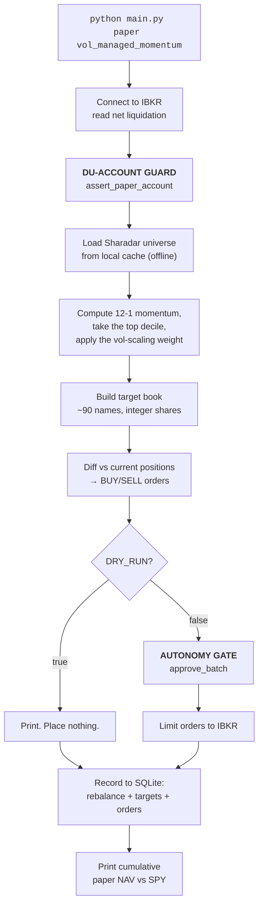

# pit-backtester — How It Actually Works

*A guided tour of the system, written to be understood rather than skimmed.*

---

## How to read this document

This is a teaching document, not an API reference. It assumes you know what a stock is
and roughly what "buy low, sell high" means, and nothing beyond that. Every piece of
jargon gets defined the first time it shows up.

It's organized in two parts:

| Part | What it covers | Read it when |
|---|---|---|
| **Chapters 1-9 — The System** | Why this exists, factor testing, IC and t-stats, Sharadar point-in-time data, combining factors, walk-forward validation, paper deployment | You want to understand how the pipeline works and why it's built this way |
| **Reference** | Metrics glossary, what actually drives the results, operator's guide, file map, honest limitations | You're actually running the thing |

Every chapter follows the same shape: **the idea → an analogy → the diagram → the actual
code → why it was built that way.** If you only read the analogies and diagrams, you'll
still come away with an accurate mental model.

A note on honesty: this document reports what the code does, including where the results
were disappointing. That's deliberate. A backtesting system that flatters itself is worse
than useless.

**About the numbers in this document.** Two kinds appear, and they are always distinguished:

- **Real** — read directly from the code, or from an actual run of the commands shown.
  Every config value and code excerpt is real.
- **📋 Illustrative** — sample console output showing the *shape* of a report, with
  plausible but invented figures, used where re-running the pipeline wasn't part of writing
  this section. Every one is tagged `📋 ILLUSTRATIVE FORMAT` with the command that produces
  the real thing. **Never quote these as results.**

---

## The 60-second version

Here is the entire system on one page.

```mermaid
flowchart TD
    subgraph DATA["DATA — point-in-time, survivorship-free"]
        D1[Sharadar: prices for every US common<br/>stock, delisted ones included] --> D2[Fundamentals dated to their<br/>FILING date, not the fiscal period end]
    end

    subgraph RESEARCH["RESEARCH — does the signal predict anything at all?"]
        D2 --> F[Factor library<br/>momentum, value, quality, crash-risk]
        F --> IC{IC harness<br/>|IC|>0.02 and |t|>2?}
        IC -->|no| DISCARD[Flagged 'no signal' —<br/>most factors end here]
        IC -->|yes| SIGN{Correct economic<br/>sign vs the literature?}
        SIGN -->|no| ARTIFACT[Flagged as a likely artifact,<br/>not a tradeable signal]
        SIGN -->|yes| COMBINE[Combine surviving, uncorrelated<br/>factors — untuned, pre-registered bar]
    end

    subgraph VALIDATE["VALIDATE — is this real, or did it just get lucky?"]
        COMBINE --> WF[Walk-forward:<br/>non-overlapping OOS windows]
        WF --> BAR{Beats SPY and a<br/>vol-matched blend,<br/>consistently, after costs?}
        BAR -->|no| TRASH[Don't deploy it]
        BAR -->|yes| CPCV[CPCV: many combinatorial<br/>OOS draws, purged + embargoed]
        CPCV --> DSR{Deflated Sharpe + PBO:<br/>real, after accounting for<br/>every trial and variant tried?}
        DSR -->|no| TRASH
        DSR -->|yes| PROMOTE[Promote to paper]
    end

    subgraph LIVE["LIVE — runs monthly, touches a paper account"]
        PROMOTE --> GATE{DU-account guard<br/>+ DRY_RUN<br/>+ autonomy gate}
        GATE --> IB[Interactive Brokers<br/>paper account, limit orders]
        IB --> DB[(SQLite: every rebalance,<br/>target, and order logged)]
    end
```

**The one-sentence summary:** every factor is checked for predictive power before any
strategy is built around it, the ones that survive are combined only when the combination
is provably not overfit, the result is stress-tested across non-overlapping stretches of
history it never got to see, and only then does it touch a broker — through two hard
safety checks that get re-verified before every single order.

**The honest headline:** the one strategy that survived this gauntlet (12-1 momentum,
volatility-managed) is, in the code's own words, "a modest, robust-but-not-Sharpe-dominant
strategy" — not a discovery of hidden alpha. Most of what went into the factor library
didn't survive contact with point-in-time data (see Chapter 4), and even the survivor
doesn't get a free pass at the end: a real CPCV/Deflated-Sharpe run put its full-history
Sharpe at only 39% likely to beat the trial-adjusted benchmark (Chapter 10) — genuinely
inconclusive, stated plainly, not rounded up. What IS well-supported is that picking this
variant over the four alternatives wasn't overfitting (PBO 8.6%, also Chapter 10). That's
the system working correctly: the point of the machinery is to find out what doesn't work
for free, and to be honest about the modesty — and the genuine uncertainty — of what does.

---
## Chapter 1: Why this exists

This project's first attempt was a hand-designed rule (a technical breakout on large-cap
momentum names), run through a day-by-day backtest engine. It worked exactly as designed.
The problem was what it found: on a risk-matched basis, it lost to a passive index — a
clean, honest negative result, not a bug.

Two possible conclusions from that:
1. The idea (technical breakouts on large-cap momentum names) doesn't have an edge.
2. The idea is fine but the *inputs* are wrong — wrong universe, wrong signal, biased data.

This system is the answer to conclusion #2, built as a general-purpose tool rather than a
one-off fix: **a way to test whether a signal predicts anything at all, before spending days
building a strategy around it** — and, once one does, to validate it hard enough that the
result can be trusted.

---

## Chapter 2: What a "factor" is

**File:** `factors/base.py`

A **factor** is a number you can compute for every stock on every day, such that ranking
stocks by that number tells you something about their future returns.

```
             Factor: momentum_12_1        Forward return (next month)
             ─────────────────────        ───────────────────────────
   NVDA            +0.82  (rank 1)                 +6.2%
   AVGO            +0.61  (rank 2)                 +3.8%
   AAPL            +0.34  (rank 3)                 +1.1%
   ...
   XYZ             −0.45  (rank 99)                −2.4%
   ABC             −0.71  (rank 100)               −5.9%

   Question: does the LEFT column predict the RIGHT column?
```

Every factor in the system produces a `date × symbol` grid of numbers:

```python
class Factor(ABC):
    name: str
    category: str          # "price" | "volume" | "fundamental"
    point_in_time_provider: bool = False

    def compute(self, data: FactorData) -> pd.DataFrame:
        """date x symbol values; value[t] uses only data <= t (no look-ahead)."""
```

And the simplest one is three lines:

```python
@register
class Momentum12_1(Factor):
    name = "momentum_12_1"
    def compute(self, data):
        # LOOK-AHEAD GUARD: shift(21)/shift(252) use only PAST closes.
        return data.close.shift(21) / data.close.shift(252) - 1.0
```

That's "12-1 momentum": the return from about 12 months ago to about 1 month ago.

**Why skip the most recent month?** Because short-term returns *reverse* — a stock that
jumped last week tends to give some back. Momentum works over 12 months but reverses over
1 month, and mixing them muddies the signal. Skipping the last month is standard practice
in the academic literature for exactly this reason.

### The factor library

**Price/volume factors** (`factors/library.py`), testable on free data:

| Factor | What it measures | Expected sign |
|---|---|---|
| `momentum_12_1` | 12-month return, skipping last month | + (winners keep winning) |
| `momentum_6_1` | Same, 6-month version | + |
| `short_term_reversal` | Negative of last week's return | + (last week's losers bounce) |
| `low_volatility` | Negative of 60-day volatility | + (calm stocks outperform) |
| `ivol_capm` | Idiosyncratic vol vs the market | − |
| `beta_low` | Negative of CAPM beta | + |
| `max_daily_return` | Biggest single-day gain in a month | − (lottery-ticket effect) |
| `ncskew`, `duvol` | Crash-risk skewness measures | − |
| `wq_alpha_101` etc. | WorldQuant formulaic alphas (Kakushadze 2016) | no prior |

**Fundamental factors** (`factors/fundamentals.py`), requiring paid point-in-time data:

| Factor | What it measures | Expected sign |
|---|---|---|
| `profitability` | Earnings relative to assets | + |
| `operating_profitability`, `gross_margin` | Quality of the business | + |
| `earnings_yield`, `fcf_yield`, `book_to_price` | Value — cheapness | + |
| `sales_growth`, `earnings_growth` | Growth | + |
| `accruals` | Earnings not backed by cash | − (a red flag) |
| `asset_growth` | Company ballooning its balance sheet | − |
| `debt_to_equity` | Leverage | − |

**The "expected sign" column is doing real work.** These signs come from the published
literature *before* any testing. Chapter 3 explains why that pre-commitment is the
difference between research and data mining.

---

## Chapter 3: The IC harness — judging a factor

**File:** `factors/evaluate.py`

This is the tool the whole research layer is built on. It answers one question cheaply:
**does this factor predict returns?** — without building a strategy, without a backtest,
without frictions.

### Information Coefficient (IC)

The procedure, once per month:

```
Step 1  On the last trading day of January, compute the factor for all 500 stocks.
Step 2  Rank the stocks by that factor:      NVDA #1, AVGO #2, ... , ABC #500
Step 3  Wait one month.
Step 4  Rank the same stocks by their actual February return.
Step 5  Ask: how similar are the two rankings?
```

That similarity is the **Spearman rank correlation**, and one month's value is one IC:

```python
ics.append(paired["f"].corr(paired["r"], method="spearman"))
```

| IC | Meaning |
|---|---|
| +1.00 | Perfect. Your #1 pick really was the best performer, straight down the list. |
| +0.05 | Weak but real, and genuinely good for a single equity factor. |
| 0.00 | No relationship at all. Coin flip. |
| −0.05 | Backwards — your top picks underperform. |

**Real-world calibration: an IC of 0.03–0.05 is a good factor.** Not 0.5. Markets are
mostly efficient; a tiny persistent edge applied to hundreds of names is what a real
quantitative firm runs on.

### Repeat 240 times

One month's IC is noise. Repeat for every month over 20 years and you get a *distribution*:

```
mean IC   = +0.032    ← the average edge
std IC    =  0.081    ← how much it bounces month to month
n         =  240      ← number of months tested
```

From those three numbers come the two summary statistics that matter:

**t-statistic — "could this be luck?"**

```python
t_stat = mean_ic / (std_ic / sqrt(n))
```

Plugging in: `0.032 / (0.081 / √240) = 0.032 / 0.00523 = 6.12`

**Analogy:** you flip a coin 240 times and get 128 heads. Is it rigged? The t-stat is
"how many standard errors away from zero is this result?" A t-stat above 2 means **less
than a 5% chance you'd see this by luck if the true effect were zero.**

**Information Ratio (IR) — "how consistent is it?"**

```python
ir = mean_ic / std_ic * sqrt(12)
```

`0.032 / 0.081 × 3.46 = 1.37`. This is roughly the Sharpe ratio of the factor's predictive
power — reward per unit of variability, annualized.

### Decile spread — the tradability check

IC is a correlation, which is abstract. The decile spread is concrete:

```
   Sort all 500 stocks by the factor, cut into 10 buckets of 50.
   Measure each bucket's average return over the next month.

   Decile 10 (best factor score)   +1.42%   ← you'd go LONG these
   Decile 9                        +1.11%
   Decile 8                        +0.98%
   ...                                        A clean monotonic ladder is the
   Decile 2                        +0.31%     sign of a real effect.
   Decile 1 (worst factor score)   +0.18%   ← you'd go SHORT these
   ─────────────────────────────────────
   TOP MINUS BOTTOM (the spread)   +1.24%/month
```

That spread is what a long/short portfolio would earn before costs. The harness also
reports its Sharpe ratio (`tmb_sharpe`).

### The bar

**File:** `factors/run_factor_eval.py`

```python
IC_THRESHOLD = 0.02
TSTAT_THRESHOLD = 2.0

def _verdict(score):
    return "BUILD" if (abs(ic) > IC_THRESHOLD and abs(t) > TSTAT_THRESHOLD) else "no signal"
```

Both conditions, always: the effect must be **big enough to matter** (|IC| > 0.02) *and*
**unlikely to be luck** (|t| > 2). Either one alone is insufficient. A tiny effect measured
very precisely isn't worth trading; a big effect measured over 12 months could easily be
noise.

### The multiple-testing problem — and the sign filter

Here's the trap that catches almost everyone. If you test 22 factors at |t| > 2, and *none*
of them work:

```python
expected_false = n_tested * 0.0455   # P(|t| > 2) ≈ 4.55% under the null
```

**You expect about one to pass anyway.** Purely by luck. That's what a 5% significance
threshold *means*.

The system prints this warning itself, in every run (*📋 counts illustrative; the 4.55%
and the wording are real*):

```
=== Multiple-testing reality check ===
  - 22 factors tested at |t|>2; under the null ~1 in 22 (4.55%) passes by chance,
    so ~1.0 false positives are EXPECTED even if nothing works.
  - 3 factors actually cleared the bar. A correct economic SIGN is the extra filter
    that separates a real effect from a lucky draw.
```

And the extra filter is the `EXPECTED_SIGN` table from Chapter 2. A factor must clear the
statistical bar **and** point the direction theory says it should. A factor that's
statistically significant in the *wrong* direction gets flagged, loudly:

```
  ! low_volatility    IC=-0.0281  t=-2.34  (prior +)
    WRONG-SIGNED passers (significant but opposite the prior => likely artifact,
    NOT a tradeable signal)
```

**Analogy:** you test 20 herbal remedies for headaches. One shows a statistically
significant effect — it makes headaches *worse*. Do you sell it as a headache cure with the
sign flipped? No. You conclude your sample has something weird in it. That's exactly the
reasoning here, and in this codebase the "something weird" turned out to be survivorship
bias (Chapter 4).

### The leakage rule, stated once

The harness is explicit about the one asymmetry that makes any of this valid:

> * Factor **VALUES** on date `t` use only data ≤ `t`.
> * Forward **RETURNS** are labels and may use the future: `close[t] → close[t_next]`.
> * **Labels are allowed to look ahead; factor values are not.**

This is the single most important sentence in the research layer. Of course the answer key
comes from the future — that's what makes it an answer key. But the student's inputs must
come only from the past.

---

## Chapter 4: The two silent killers

The project plan named them on day one:

> Look-ahead bias and overfitting are the two silent killers.

Here's the third, which turned out to be the one that mattered most.

### Killer 1: Look-ahead bias

Every factor prevents it with backward-only `shift()` and `rolling()` operations — each one
flagged in its own source with a `LOOK-AHEAD GUARD` comment (Chapter 2).

That's still just a claim a human wrote next to the code. It's *verified*, not just
asserted, two ways.

**Every research run** spot-checks one real factor against the real, live Sharadar data
(`factors.run_factor_eval.assert_filing_date_safety`):

```python
def assert_filing_date_safety(data, factor_name="profitability"):
    """The value at the cutoff must be IDENTICAL when future bars are deleted."""
    full = factor.compute(data).loc[cutoff]
    truncated = FactorData(... every panel sliced to [:cutoff] ...)
    trunc = factor.compute(truncated).loc[cutoff]
    assert (full - trunc).abs().max() < 1e-9, f"FILING-DATE LEAK in {factor_name}"
```

**Every test run** generalizes that exact idea into a property test that covers the *whole*
factor registry on synthetic data (`tests/test_no_lookahead.py`), driven by `hypothesis`:

```python
@given(seed=st.integers(...), n_symbols=st.integers(3, 6))
def test_no_factor_uses_future_data(seed, n_symbols):
    data = _make_factor_data(seed, n_symbols)     # random synthetic panel
    truncated = _truncate(data, cutoff)            # every future row deleted

    for name, cls in all_factors().items():        # EVERY registered factor, automatically
        full_row = cls().compute(data).loc[cutoff]
        trunc_row = cls().compute(truncated).loc[cutoff]
        assert full_row.equals_within_tolerance(trunc_row)   # simplified; see the real assertion
```

Because it iterates the registry rather than naming factors, a new factor is checked the
moment it's registered — zero new test code. It genuinely catches leaks: injecting a
one-line bug into `momentum_12_1` (`shift(-1)` instead of `shift(21)` — reading tomorrow's
close) fails the test immediately, naming the exact factor and the exact date, and
hypothesis shrinks the failure to the smallest reproducing case (`seed=0, n_symbols=3`).

**The logic is beautiful in its simplicity:** if a factor's value on June 1st genuinely
uses only data through June 1st, then deleting everything after June 1st can't change it.
If the number moves, the factor was peeking. This is a *proof*, not a code review.

### Killer 2: Overfitting

Overfitting is finding a rule that explains the past perfectly and the future not at all.
Test 500 rules on the same 15 years and one will look spectacular by chance.

The defenses in this codebase:

- **Parameters are documented as untuned.** From `config.py`: *"All values are research
  defaults; none were tuned to the result."*
- **Chronological train/test splits, never random.** `research/combine_train.py` holds out
  the last `OOS_FRACTION` (30%) of monthly rebalances by *date* and never lets anything
  chosen on that stretch feed back into the earlier one.
- **No weight-fitting at all in the combination that survived.** `factors/composite.py`
  combines factors with a fixed, un-tuned 50/50 weight — there's no coefficient to overfit
  because nothing gets fit.
- **The economic-sign filter** — a rule with no theoretical justification is presumed to be
  data mining.
- **Walk-forward validation** (Chapter 8), which is the real test.

### Killer 3: Survivorship bias — the one that mattered

This one is subtle and it invalidated most of the early results.

Your universe is 85 hardcoded tickers: AAPL, MSFT, NVDA, JPM, XOM… **Every one of them
still exists today.** That's why you could type them from memory.

```
   What you tested:                    What was actually there in 2010:
   ┌──────────────────┐                ┌──────────────────────────────────┐
   │ AAPL   ✅ alive  │                │ AAPL       ✅ still here         │
   │ MSFT   ✅ alive  │                │ MSFT       ✅ still here         │
   │ NVDA   ✅ alive  │                │ NVDA       ✅ still here         │
   │ JPM    ✅ alive  │                │ LEHMAN     ❌ bankrupt 2008      │
   │ XOM    ✅ alive  │                │ SEARS      ❌ bankrupt 2018      │
   └──────────────────┘                │ BEAR ST.   ❌ collapsed 2008     │
                                       │ GE         ⚠️  −80%, still here  │
   100% survivors                      └──────────────────────────────────┘
```

**Every backtest on that list is a backtest on companies you already know survived.** The
returns are inflated. And the distortion isn't uniform — it hits *risk* factors hardest,
because the companies that vanished were disproportionately the volatile, indebted,
high-beta ones. Delete the failures and "high volatility" stops looking dangerous.

This is exactly what the results showed. The `low_volatility`, `beta_low`, `ivol_capm`, and
`max_daily_return` factors all came out with **inverted signs** — the code calls them the
"risk cluster" and tracks whether broadening the universe fixes them:

*📋 ILLUSTRATIVE FORMAT — run `python main.py factors` for the real IC values. The
*direction* of the finding (inverted signs that weakened but didn't flip) is real and is
what the code's own verdict text reports.*

```
=== Risk-factor cluster: does broadening fix the inverted signs? ===
       factor expected_sign  large_IC  broad_IC broad_sign_ok moved_toward_expected
   ivol_capm              -   +0.0312   +0.0198            no                   yes
    beta_low              +   -0.0287   -0.0154            no                   yes
low_volatility            +   -0.0341   -0.0203            no                   yes
```

Widening from 85 names to 300+ moved every one of them *toward* the expected sign but
didn't flip any. Diagnosis, stated in the code's own output:

> Broadening WEAKENED the inverted risk-factor signs toward their expected direction but
> did NOT reverse them. That is consistent with large-cap concentration inflating the
> inversion, yet leaves survivorship bias unresolved.

The only real fix is data that includes the dead companies. Which is what you bought.

---

## Chapter 5: Sharadar — buying honest data

**Files:** `data/sharadar_provider.py`, `data/archive_sharadar.py`, `backtest/universe.py`

Three tables from Sharadar (via Nasdaq Data Link) solve three distinct problems.

### Table 1: SHARADAR/TICKERS — the survivorship fix

A symbol master **including delisted companies**, with first and last price dates. You can
now reconstruct what the investable universe actually looked like on any historical date —
Lehman Brothers included, right up until it wasn't.

```python
SHARADAR_MAX_SYMBOLS = 1500   # the most-liquid survivorship-free US common stocks
tickers = select_liquid_sharadar_universe(provider, max_symbols=SHARADAR_MAX_SYMBOLS)
```

### Table 2: SHARADAR/SEP — daily prices for all of them, including the dead ones.

### Table 3: SHARADAR/SF1 — the point-in-time fix

This is the one worth paying for, and the reason is one column.

A company's Q1 results cover January–March. But they're not *filed* until mid-May. Between
those dates, nobody knows the numbers.

```
   Jan 1 ──────── Mar 31 ──────────────── May 15 ────────▶
                     │                       │
                     │                       └─ datekey       ← WHEN IT WAS FILED
                     └───────────────────────── calendardate  ← the period it covers

   Using calendardate leaks ~6 WEEKS of future information into every factor.
```

The provider keys everything to `datekey`, and the docstring is emphatic about why:

> We use dimension `ARQ` (As-Reported Quarterly) and key every value to its `datekey` (the
> SEC **FILING** date), NOT `calendardate` (the fiscal period end). **This is the entire
> point of paying.** Using `calendardate` would leak weeks-to-months of future information.

`build_fundamental_panels` places each filing's value on its filing date and forward-fills
from there. So `fundamentals["revenue"].loc["2015-04-20"]` returns whatever was the latest
*publicly filed* revenue as of April 20th, 2015 — not the quarter that had already ended but
wasn't announced yet.

**Analogy:** it's the difference between "what happened in the game" and "what had been
reported on the news by the time you placed your bet." Only the second one is a fair test
of your handicapping.

### Two operational touches worth stealing

**Stub mode.** If no API key is present, the provider constructs fine but every real data
call raises `SharadarUnavailable` with a descriptive message. That let the entire
pipeline — provider, factors, universe selection, harness, tests — be built and verified
*before* the subscription existed. Only the final numbers were gated on the key.

**The offline archive.** `data/archive_sharadar.py` bulk-downloads every table to local
Parquet once:

```bash
python data/archive_sharadar.py            # archive all tables
python data/archive_sharadar.py --verify   # PROVE cache-only mode hits no API
```

After that, `cache_only=True` is the default and the research pipeline runs with **zero API
calls**. Your research keeps working after the subscription lapses. `--verify` exists
specifically to prove there's no hidden network dependency.

---

## Chapter 6: Combining factors into a strategy

**Files:** `factors/composite.py`, `research/combine_train.py`

Once the honest scorecard ran on point-in-time, survivorship-free data, exactly **two**
factors were individually significant, correctly signed, and economically distinct:

- **`momentum_12_1`** — a price signal
- **`profitability`** — a fundamental signal

### Why combining these two specifically is legitimate

This is a subtle but important point about research integrity. Combining factors is
usually how you overfit — try enough weightings and something will look great.

The justification here is stated up front, before any results:

> Price and fundamental signals are nearly uncorrelated by construction, so combining them
> is the legitimate, non-overfit diversification case — NOT data mining.

Two signals from genuinely different information sources should diversify. Two price
signals mostly just re-measure the same thing.

### The untuned combination

```python
# DELIBERATELY UNTUNED. Fixed 50/50, NO weight fitting: tuning weights to the scorecard
# would just overfit the very results we are trying to validate.
```

Two equally simple rules, both parameter-free:

```
  ZSCORE MODE                            RANK MODE
  ───────────                            ─────────
  For each date:                         For each date:
    momentum   → z-score across names      momentum   → percentile rank 0..1
    profitability → z-score                profitability → percentile rank 0..1
    score = (z_mom + z_prof) / 2           score = (r_mom + r_prof) / 2
```

Both normalizations are **cross-sectional** — computed within a single date's column of
names. No time-series information crosses dates, so the look-ahead safety of the components
carries through automatically.

One more detail: a stock is scored only if **every** component is present. The composite
genuinely requires both signals, rather than degrading into whichever one happens to have
data.

### The bar, again set in advance

From `research/combine_train.py`, before any result was computed:

> The composite must:
> 1. beat **BOTH** standalone factors' IC (full history), **and**
> 2. clear the IC bar (|IC| > 0.02, |t| > 2) **out of sample** (last ~30%), **and**
> 3. beat passive (SPY buy-hold and the vol-matched blend) **after realistic costs**.

Three hurdles, all specified before seeing a number. This is the discipline that separates
research from storytelling.

**An earlier attempt at this — a Ridge regression fit on free, today's-survivors-only data
with a single train/test split — was tried first and retired.** Its own printed output said
why: *"this is a SINGLE train/test split — a real edge needs point-in-time data and
walk-forward."* That is exactly what the Sharadar + walk-forward pipeline in this chapter
and the next two provides. The git history has the retired version if it's ever useful as a
reference; this document describes what's actually running.

---

## Chapter 7: Vol-managed momentum — the one survivor

**Files:** `research/momentum_variants.py`, `strategies/vol_managed_momentum.py`

Momentum was the one factor that cleared every bar. But momentum has a famous, brutal flaw.

### Momentum crashes

Momentum works quietly for years, then loses 40% in two months. It happens at market
*reversals*: after a crash, momentum is short the beaten-down names and long the defensive
ones. When the market violently rebounds, the beaten-down names rip upward and the momentum
book gets destroyed from both sides. Spring 2009 is the textbook case.

```
   momentum
   returns  │      ╱╲    ╱╲╱╲    ╱╲                         ╱╲    ╱╲
            │  ╱╲╱    ╲╱      ╲╱    ╲                     ╱    ╲╱
            │╱                        ╲                 ╱
            │                          ╲               ╱
            │                           ╲             ╱
            │                            ╲___________╱   ← the 2009 momentum crash
            └───────────────────────────────────────────────────▶
                     calm years              reversal
```

### Pre-specifying the fixes — no mining

`research/momentum_variants.py` tests five variants **head to head, all specified in advance**:

| Variant | What it is |
|---|---|
| A. `momentum_12_1` | Baseline |
| B. `vol_managed_momentum` | Barroso & Santa-Clara (2015): scale exposure inversely to momentum's own recent volatility |
| C. `mom_plus_value` | Equal z-score blend with the strongest value factor |
| D. `mom_plus_quality` | Equal z-score blend with profitability |
| E. `risk_managed_quality_mom` | Vol management applied to D |

And it says why the result should be expected to be modest:

> These are all **WELL-KNOWN** fixes, so any surviving edge is expected to be modest, not
> hidden alpha.

That's the right posture. If a published 2015 paper's technique produced 3.0 Sharpe on your
laptop, the correct reaction is to look for the bug.

### How the vol overlay works

**The observation:** momentum crashes are *predictable in one specific way* — they happen
when momentum's own volatility is already elevated. So shrink the bet when things get wild.

```python
def vol_target_weights(returns, train_end, window, cap):
    realized = returns.rolling(window).std()
    target = realized[realized.index < train_end].median()   # fixed from TRAIN only
    return (target / realized.shift(1)).clip(upper=cap)
```

```
   Recent momentum vol   →   Gross exposure
   ─────────────────────     ──────────────
   Very calm (half normal)   200%  ← capped at leverage_cap = 2.0
   Normal                    100%
   Elevated (2× normal)       50%
   Wild (4× normal)           25%  ← the crash regime; you're mostly out
```

**Two look-ahead guards, both flagged in the code:**

1. `realized.shift(1)` — this month's weight uses only volatility realized *before* this
   month.
2. The constant `target` is the median trailing vol over the **training window only**,
   strictly before `train_end`. So a test period is scaled by a target fixed from its past.

Guard #2 is subtle and easy to get wrong. If you set your vol target using the full sample
median, you've used the future to calibrate the past — a leak that would flatter every
result. The code fixes the target before the test window begins.

**Analogy:** it's cruise control that reads the road surface. On dry pavement it holds
speed; when the road gets slick it eases off *before* the corner, using only what the
sensors have already seen — not a weather forecast.

### The two variants

```python
long/short  — long the top decile, short the bottom decile, vol-scaled
long-only   — long the top decile only, vol-scaled, remainder in cash earning the risk-free rate
```

The long-only version exists because paper (and most retail) accounts can't easily short.
**That's the variant deployed to paper.**

### Portfolio construction

Notice what `paper_book()` explicitly refuses to do:

```python
# A per-trade risk-based sizer would grossly over- or under-allocate a ~90-name decile —
# that is a different strategy than the equal-weight one that survived walk-forward.
per_name_weight = min(gross / len(names), config.MAX_POSITION_PCT)
```

This is exactly right and easy to get wrong. The strategy that survived validation was an
**equal-weight decile portfolio**. Deploying it with a different sizing rule would deploy a
strategy that was never tested. The existing 10% per-name cap still applies as a backstop.

---

## Chapter 8: Walk-forward — the real robustness test

**File:** `backtest/walkforward.py`

A single train/test split can get lucky. Your 30% holdout might just happen to be a
momentum-friendly stretch.

**Walk-forward validation** slices the entire history into **non-overlapping** windows and
tests each one out-of-sample:

```
1998 ─────────────────────────────────────────────────────────────── 2026
     ├────────┤ TRAIN                                                       (window 1 setup)
              ├────────┤ TEST  2001-2004
                       ├────────┤ TEST  2004-2007
                                ├────────┤ TEST  2007-2010   ← includes the GFC
                                         ├────────┤ TEST  2010-2013
                                                  ├────────┤ TEST  2013-2016
                                                           ├────────┤ ... etc

Each window's vol target comes ONLY from data strictly BEFORE that window.
Nothing is ever chosen by looking at a test window.
```

```python
WINDOW_YEARS = 3

for start, end in windows:
    ret = strategy.portfolio_returns(data, eligible,
                                     train_end=start,   # target fixed from BEFORE the window
                                     start=start, end=end)
```

**Why this is the real test:** you're not asking *"did it work?"* You're asking *"how often
does it work, and how bad is the worst case?"* A strategy with Sharpe 1.2 that's positive in
9 of 9 windows is a fundamentally different animal from one with Sharpe 1.2 that made
everything in a single lucky window.

### What it reports

*📋 ILLUSTRATIVE FORMAT — run `python main.py strategy vol_managed_momentum` for the real
window table. The summary counts quoted at the end of this chapter (9/9 positive, 5/6 on
return) come from the code's own header and are real.*

```
=== Walk-forward (non-overlapping OOS windows, after costs) ===
   window  months   CAGR  Sharpe  Sortino  maxDD  SPY_Sharpe  beat_SPY  beat_EWmkt
2001-2004      36  +8.2%   +0.61    +0.88 -14.2%         n/a       n/a           Y
2004-2007      36  +6.4%   +0.52    +0.71 -11.0%         n/a       n/a           Y
2007-2010      36  +1.1%   +0.09    +0.13 -18.4%         n/a       n/a           Y
2010-2013      36  +9.8%   +0.74    +1.02 -12.7%       +0.68         Y           Y
...

Windows: 9 | Sharpe distribution: min +0.09, median +0.52, max +0.81; 9/9 positive.
Beat SPY (where SPY exists, 6 windows): 4/6 on Sharpe, 5/6 on return.
WORST window: 2007-2010 -> Sharpe +0.09, maxDD -18.4%, CAGR +1.1%.
```

**The WORST window line is the most valuable output in this entire document.** Average
performance is a marketing number. The worst window is what you actually have to survive
before you lose faith and turn the system off.

### The capacity check

*📋 ILLUSTRATIVE FORMAT — the turnover, ADV, and capacity figures below are invented to
show the shape of the report. The 5/15/40 bps tiers and the 1% ADV cap are real config
values.*

```
--- Capacity / turnover (honest order-of-magnitude) ---
  Annual one-way turnover (long leg): ~340% of the book per year.
  Median name ADV in universe: $18,400,000/day; ~90 names per decile.
  At 1% ADV participation, rough capacity ceiling ~$16,560,000 per side.
  Costs scale UP on smaller names (5 / 15 / 40 bps by tier); a real book skewed to
  thin names pays the small-tier rate, so the 15 bps/side here is optimistic at scale.
```

Monthly momentum deciles turn over heavily — you replace much of the book several times a
year, and every turn pays costs. This is why a strategy can have a genuine edge and still
not be worth running. The code computes and prints your actual figure, unprompted, along
with the warning that its 15 bps/side assumption is "optimistic at scale."

### The verdict recorded in the code

From the header of `decision/run_paper_strategy.py`:

> Walk-forward: **positive Sharpe 9/9 windows, beat market on return 5/6, ~flat through the
> GFC** — a modest, robust-but-not-Sharpe-dominant strategy. Collecting live evidence —
> **NOT a confirmed edge.**

That framing is correct and worth preserving. Robust across windows, survived 2008,
beats the market on return most of the time — but *not* dominant on risk-adjusted return.
Worth paper-trading, not worth betting the account on.

*(Note: I read these figures from the code's own header; I did not re-run the walk-forward
in this session. Running `python main.py strategy vol_managed_momentum` reproduces them.)*

---

## Chapter 9: Paper deployment on IBKR

**File:** `decision/run_paper_strategy.py`

The final step: take the strategy that survived walk-forward and run it, monthly, against
the paper account — **through the exact same safety machinery as everything else.**



### The diff-to-orders step

You don't liquidate and rebuild every month. You compute the difference:

```python
for symbol in sorted(set(target) | set(current)):
    delta = target.get(symbol, 0) - current.get(symbol, 0)
    if delta == 0:
        continue
    orders.append({"symbol": symbol,
                   "action": "BUY" if delta > 0 else "SELL",
                   "shares": abs(delta), ...})
```

Hold 100 shares of NVDA, want 140 → BUY 40. Hold 200 of AMD, want 0 → SELL 200. Only the
delta trades, which is what keeps that 340% turnover from becoming 800%.

There's a nice defensive detail: for a held name that has dropped out of the cached
universe, the reference price falls back to the position's own per-share market value, so
**every exit still gets a price-protected limit order** rather than a naked market order.

### What one cycle prints

*📋 ILLUSTRATIVE FORMAT — the header text and guard block are verbatim from the code; the
holdings, orders, and track-record figures are invented.*

```
====================================================================================
MONITORED PAPER VALIDATION — vol_managed_momentum (LONG-ONLY vol-managed momentum)
====================================================================================
This is forward paper validation of a MODEST, robust-but-not-Sharpe-dominant strategy
(walk-forward: positive Sharpe 9/9 windows, beat market on return 5/6, flat through the
GFC). Collecting live evidence — NOT a confirmed edge. LIVE broker.

--- Safety-guard status (unchanged existing guards) ---
  DU-account guard : PASSED DU1234567
  DRY_RUN          : False  (ARMED — gate will prompt)
  Autonomy mode    : approve_batch

--- Target portfolio (as of 2026-06-30; equity $1,000,000) ---
  Vol-scaling gross exposure: 87% (Barroso-Santa-Clara), 91 names, $870,000 invested.
symbol  target_shares  price  est_value  weight_%
  AAPL             47  201.4       9467      0.95
  NVDA             67  142.3       9534      0.95
  ...
  ... and 76 more names.

--- Orders to reach target (from 88 current position(s)) ---
symbol action  shares  est_value
  ABNB   SELL      31      4820
  AMD     BUY      52      7930
  ...
  34 buys, 29 sells.

=== Cumulative LIVE paper track record (vs SPY) ===
  Since 2026-04-30 (3 cycle(s)):
    Paper NAV : +2.14%   ($1,000,000 -> $1,021,400)
    SPY       : +1.87%
    Excess    : +0.27% vs SPY so far.
```

Three things about that output:

1. **The safety-guard status block prints every time.** You always see the state of the
   guards before you're asked to approve anything.
2. **The header refuses to oversell.** "Collecting live evidence — NOT a confirmed edge."
3. **The track record only counts live NAV points.** Offline previews are written with
   `live = 0` and excluded from the comparison.

### Why paper trading at all, when the backtest already ran?

Backtests can't capture: real fill prices, real slippage on your actual order sizes, orders
that get rejected, data pipeline breaks at 9:29am, or your own behavior when the strategy
is down 12% and you have to decide whether to keep going.

The paper track record accumulates one honest row per month. That's the evidence that
eventually justifies moving from `approve` to `semi_auto` — or justifies shutting it off.

---

## Chapter 10: Was that real, or did the search just get lucky?

**File:** `research/cpcv.py`

Walk-forward (Chapter 8) is a real improvement over one in-sample backtest — but it's
still built from a small, fixed number of sequential windows. If you tried several
variants along the way (Chapter 7 tried five), and each walk-forward run is itself one
draw, there's a question walk-forward alone can't answer: **given how many
effectively-independent looks this whole process took, what's the chance the number you're
looking at is luck?**

Two techniques, both from the same "partition history into groups, try every
combination" machinery, answer two different halves of that question.

### Combinatorial Purged Cross-Validation (CPCV) — many out-of-sample draws, not one

Instead of one sequential walk-forward, split the rebalance timeline into `N` groups and
evaluate **every way of choosing `k` of them as the test set** — `C(N, k)` splits, not
`N`. With `N=8, k=2` that's 28 out-of-sample draws instead of the walk-forward chapter's 9.

```
Groups:  [1][2][3][4][5][6][7][8]

Split 1: test = {2,5}   train = everything else, minus the purge/embargo zone around 2 and 5
Split 2: test = {2,6}   train = ...
Split 3: test = {3,7}   train = ...
   ...                  (28 splits total = C(8,2))
```

**PURGE and EMBARGO, stated precisely:** a monthly rebalance's return LABEL spans from
that date to the next one. If a training date's label would reach into a test group, that
training date is dropped (*purge* — one position, immediately before the test block). And
because monthly returns aren't perfectly independent, the few dates right after a test
block are *also* dropped from train (*embargo*) so nothing about the test period's
aftermath leaks backward into training. Both are enforced in `cpcv_splits()`, and
`tests/test_cpcv.py` checks it directly: no purged or embargoed position ever appears in a
split's train set.

The result is a **distribution** of out-of-sample Sharpes, not one number — the same shift
in thinking the worst-window line made valuable in Chapter 8, but from many more draws.

### The Deflated Sharpe Ratio — correcting for how hard you searched, and for non-normal returns

**Source:** Bailey & López de Prado (2014), "The Deflated Sharpe Ratio."

A Sharpe ratio assumes returns are normally distributed and that you tried this exactly
once. Neither is true here — monthly momentum returns are skewed (crash risk, Chapter 4),
and the walk-forward/CPCV process tried many out-of-sample windows before this document
called anything "the survivor."

DSR corrects for both. It uses the CPCV path Sharpes to estimate how much a set of
similarly-searched trials could look good **by chance alone** (their *variance*, not their
level, is what matters — five trials that all cluster together imply a small search space;
five that scatter widely imply a much bigger one):

```python
# The benchmark a real result must clear, given how much the "attempts" varied:
sr0 = sqrt(Var[trial_Sharpes]) * ((1 - euler_gamma) * z1 + euler_gamma * z2)

# Then: does the observed Sharpe clear THAT bar, adjusted for skew/kurtosis?
z = (sr_hat - sr0) * sqrt(n_obs - 1) / sqrt(1 - skew*sr_hat + (kurtosis-1)/4*sr_hat**2)
dsr = Phi(z)   # probability the TRUE Sharpe exceeds the trial-adjusted benchmark
```

**Why the trials matter more than the headline Sharpe.** A 0.82 Sharpe from one lucky
lonely backtest and a 0.82 Sharpe that consistently clears a benchmark built from 28
genuinely different out-of-sample draws are not the same claim. DSR is the number that
tells them apart.

### Probability of Backtest Overfitting (PBO) — did picking "the best" pick noise?

**Source:** Bailey, Borwein, López de Prado & Zhu (2014), "The Probability of Backtest
Overfitting" (the CSCV procedure).

PBO needs more than one candidate to be meaningful — which is exactly what Chapter 7's
five pre-specified momentum-crash-fix variants already are, a genuine "trials matrix" this
codebase produced honestly, not one fabricated to make PBO computable
(`research.momentum_variants.build_variant_returns`).

The procedure: split history into groups, and for every way of using **half as train and
the complementary half as test**, find whichever variant looks best IN-SAMPLE and check
where its OUT-OF-SAMPLE Sharpe **ranks** among all five:

```
   In-sample winner this split: D_mom_plus_quality
   Its out-of-sample rank among all 5 variants: #4 of 5  (below the median)
   -> this split counts toward PBO: picking "the best" here would have picked noise.
```

`PBO` is the fraction of splits where that happens. **Near 50% means the in-sample winner
is indistinguishable from a coin flip out of sample — classic overfitting.** Well below it
means the winner tends to generalize. `tests/test_cpcv.py` verifies both directions on
synthetic data: a genuinely-better variant produces low PBO, and five indistinguishable
noise variants average to ~50% PBO across seeds (a single seed is a noisy estimate of
that — a known property of CSCV with finite data, not a bug, which is why the test
averages several seeds rather than trusting one).

**One subtlety worth naming, because it was a real bug caught by testing this against a
known-noise scenario before trusting it:** the relative rank must be computed as
`rank / (N+1)`, not `rank / N` — dividing by `N` shifts the "exactly average" case away
from 0.5, which quietly biases PBO downward for every run. Property-testing against
synthetic pure-noise data (Chapter 1's philosophy, applied here too) is what caught it.

### What this run actually said

```
python main.py strategy vol_managed_momentum
```
```
CPCV — combinatorial purged cross-validation (vol_managed_momentum)
  28 splits | Sharpe distribution: min -0.23, median +0.44, max +0.99; 25/28 positive.

--- Deflated Sharpe Ratio (Bailey & Lopez de Prado 2014) ---
  Observed Sharpe (annualized)      : +0.61
  Benchmark SR0 from 28 CPCV trials (annualized): +0.67
  Return skew / kurtosis             : -0.09 / 5.80 (normal = 0 / 3)
  Deflated Sharpe Ratio (probability true Sharpe > SR0): 39.4%

--- Probability of Backtest Overfitting (Bailey et al. 2014, CSCV) ---
  5 candidate variants, 70 train/test splits
  PBO = 8.6% (fraction of splits where the in-sample-best variant finished at/below the OOS median)
  => LOW — the winning variant tends to generalize.
```

**Read plainly:** the full-history Sharpe is only 39.4% likely to beat what 28
genuinely different out-of-sample draws would produce by chance — that is NOT a passing
grade, and this document isn't rounding it up to one. What the run *does* support is that
the choice of *this* variant over the other four wasn't the overfitting: an 8.6% PBO says
the selection process generalizes even though the resulting Sharpe itself remains
unproven. Both things are true at once, and reporting only one of them would be the kind
of cherry-picking this whole chapter exists to catch.

---

# Reference

---

## Metrics glossary

Everything the system prints, in plain English, with a sense of what "good" looks like.
Real figures below are from an actual `python main.py strategy vol_managed_momentum` run
(OOS = the last 30% of history, never used to choose anything) — they will shift slightly
as the local Sharadar cache is refreshed, but the shape of the story won't.

### Return metrics

**Total return** — end value ÷ start value − 1. Simple, but not comparable across different
time spans.

**CAGR (Compound Annual Growth Rate)** — the smooth annual rate that would produce the same
final result.
```
CAGR = (end / start)^(1/years) − 1
```
*OOS: vol-managed momentum +23.90%, SPY buy-hold +14.12%.*
**Rough calibration:** the S&P has done ~10%/yr long-term. Beating it consistently is hard.

### Risk metrics

**Max drawdown** — the worst peak-to-trough decline ever suffered.
```
      peak
       ╱╲
      ╱  ╲
     ╱    ╲______
    ╱            ╲          ← max drawdown = how far down from the peak
   ╱              ╲___╱╲
                trough
```
*OOS: vol-managed momentum -26.04%, SPY -23.93%.* Close — the vol-targeting overlay limits
gross exposure but doesn't eliminate drawdown; it's judged on Sharpe and Sortino, not on
beating the index on drawdown alone.

### Risk-adjusted metrics — the ones that decide things

**Sharpe ratio** — monthly return per unit of monthly volatility, above the risk-free rate,
annualized.
```python
sharpe = (mean_excess_monthly_return / std_monthly_return) * sqrt(12)
```
*OOS: vol-managed momentum 0.82, SPY buy-hold 0.67, vol-matched SPY/cash blend 0.67.*

| Sharpe | Interpretation |
|---|---|
| < 0 | You lost to cash |
| 0 – 0.5 | Weak |
| 0.5 – 1.0 | Decent — the S&P sits here long-term |
| 1.0 – 2.0 | Very good |
| > 2.0 | Either exceptional, or you have a bug. Check for a bug first. |

**Sortino ratio** — like Sharpe, but only counts *downside* deviation. Upside surprises
shouldn't be penalized. *OOS: 1.49 vs SPY's 1.03.*

### Relationship metrics

**Correlation / beta to SPY** — how tightly, and how much, the strategy moves with the
market. A long-only momentum decile is meaningfully correlated to the market by
construction (it's long stocks); the vol overlay caps how much of that exposure it carries
when momentum's own volatility spikes.

### Factor metrics

**IC (Information Coefficient)** — cross-sectional rank correlation between a factor today
and returns next month. **Good = 0.03–0.05.** Above 0.10 sustained means check for leakage.

**t-statistic** — how many standard errors from zero. **|t| > 2 ≈ under 5% chance of luck.**
But see the multiple-testing note in Chapter 4 — test 24 factors and expect roughly one
lucky pass even if nothing works.

**IR (Information Ratio)** — mean IC ÷ std IC × √12. Consistency of the predictive power.

**Decile spread** — average return of the top 10% minus the bottom 10% by factor score. The
concrete tradable version of IC.

---

## What actually drives the results

The market conditions the system reacts to, and how much each one moves your results.

### 1. Volatility — the thing the whole overlay is built around

Volatility shows up in three places, and it's worth seeing them together:

| Where | What it does |
|---|---|
| **Trailing realized vol of the strategy's own returns** | Drives the Barroso-Santa-Clara gross-exposure scaling (Chapter 7) |
| **The vol target itself** | Fixed from the TRAIN window only — never recalibrated on data the test window could see |
| **Annualized vol (reporting)** | The denominator of Sharpe |

**The key insight the whole overlay encodes:** volatility is *predictable* in a way returns
are not. You cannot forecast next month's return. You *can* forecast that next month will
be volatile if this month was — that's why exposure is scaled by realized vol rather than
by any return forecast.

### 2. The risk-free rate

`RF_ANNUAL = 0.04` in `research/combine_train.py` — 4% annual, used in every Sharpe and
Sortino calculation and in the cash leg of the vol-matched blend benchmark.

**Why it matters more than it looks:** when cash pays 5%, every strategy must clear a
higher bar. The same strategy has a very different Sharpe depending on the rate
environment, which is why the 4% figure is an explicit, visible constant rather than a
hidden zero.

### 3. Liquidity and capacity

| Threshold | Value | Why |
|---|---|---|
| `MIN_DOLLAR_VOLUME` | $5,000,000/day | Below this you can't get in or out at a sane price |
| `MIN_PRICE` | $5.00 | Sub-$5 stocks have wide spreads and different market structure |
| `MAX_ADV_PARTICIPATION` | 1% of ADV | Never model buying more than 1% of a stock's daily volume |
| Slippage tiers | 5 / 15 / 40 bps | Small caps cost 8× more to trade than mega-caps |

**Why this is where most backtests lie.** A decile of ~90 names sorted by momentum turns
over heavily every month; the 1% ADV participation cap and tiered slippage are what keep
that turnover's cost honest instead of assumed away. `walkforward.capacity_report()` prints
the actual figure every run, unprompted, along with the warning that its cost assumption is
"optimistic at scale" for a book skewed toward thinner names.

### 4. Costs and turnover

```
Monthly momentum decile turnover: ~300%+ of the book per year (real, run-dependent figure)
Slippage                          5-40 bps per side, by liquidity tier (real config values)
```

**Do the arithmetic on whatever turnover a run reports.** At 300% annual turnover: 300% ×
2 sides × 15bps ≈ **1.0% per year in costs alone**. If a strategy's edge is 2% a year, half
of it goes to friction before anything else. This is why turnover is a first-class metric
in the capacity report, not an afterthought.

---

## Operator's guide

### Prerequisites

```bash
python -m venv venv && source venv/bin/activate
pip install -r requirements.txt
cp .env.example .env      # then fill in your keys — NEVER commit .env
```

For anything touching the broker: **TWS or IB Gateway must be running**, logged into your
paper account, with the API enabled (*Global Configuration → API → Settings*), on port
7497. For the Sharadar-backed commands (`factors`, `altdata`, `strategy`, `paper`): a local
offline archive built once via `python data/archive_sharadar.py` (needs a
`NASDAQ_DATA_LINK_API_KEY`; every command after that runs with zero API calls).

### The commands

`main.py` is the single entry point. **Every subcommand runs a paper-safety self-check
first** — it never touches the broker, but it does assert the DU-account guard logic and
`DRY_RUN` are intact before doing anything else.

| Command | What it does | Touches the broker? |
|---|---|---|
| `python main.py factors` | Factor IC scorecard: large vs broad free-data universes, then the full point-in-time Sharadar fundamentals run | No |
| `python main.py altdata` | Insider (SF2) / institutional (SF3) factor gauntlet vs momentum | No |
| `python main.py strategy vol_managed_momentum` | Portfolio backtest + OOS benchmark + walk-forward + capacity report | No |
| `python main.py paper vol_managed_momentum` | One monthly paper rebalance | **Yes** |
| `python main.py paper vol_managed_momentum --no-broker` | Same, offline preview, places nothing | No |

There are also standalone scripts for specific research questions:

```bash
python data/archive_sharadar.py            # build/refresh the offline Sharadar archive
python -m backtest.walkforward             # just the walk-forward table + capacity
python research/combine_train.py           # does the momentum+profitability composite beat each alone?
python research/momentum_variants.py       # five pre-specified momentum-crash fixes, head to head
python factors/run_altdata_eval.py         # insider + institutional factors through the gauntlet
python scripts/test_connection.py          # read-only IBKR connection check, places nothing
```

### Pre-flight checklist before any paper session

```
□  TWS / IB Gateway running and logged into the PAPER account
□  API enabled, port 7497
□  echo $IB_PORT          → 7497 (not 7496)
□  echo $DRY_RUN          → run once with True first
□  echo $AUTONOMY_MODE    → approve or approve_batch
□  python main.py paper vol_managed_momentum --no-broker → preview looks sane
□  Read the "Safety-guard status" block before typing y
```

### Where the output lands

```
backtest/cache/ohlcv/             ← size-tier free-data universes (Parquet)
data/cache/sharadar/              ← the full offline Sharadar archive
trading_agent.db                  ← paper rebalance / target / order history (SQLite)
logs/                             ← timestamped run logs
```

### Reading the paper track record

Every `main.py paper` cycle appends to `trading_agent.db` (`storage/database.py`):
`paper_rebalance` (one row per cycle: equity, gross exposure, SPY level, autonomy mode),
`paper_target` (the target book for that cycle), and `paper_order` (the orders generated to
reach it). `load_paper_track_record()` reads only rows where `live=1` (a real broker NAV,
not an offline preview), so `python main.py paper ... --no-broker` never pollutes the
comparison against SPY.

### Running the tests

```bash
pip install -r requirements-dev.txt
pytest                                  # the whole offline suite
```

What's covered: factor formula fidelity and the look-ahead-safety property; the IC/decile
harness; the composite and fundamental factor families; the vol-managed-momentum overlay
and its crash-fix variants; the paper-rebalance diff-to-orders logic; and the DU-account +
`DRY_RUN` guards (proven unbypassable with a mocked broker). CI runs the full suite with
coverage on every push and fails the build on any failure.

---

## Map of the repository

```
pit-backtester/
│
├── config.py                    ⚙️  every tunable number, one file
├── main.py                      🚪 the single entry point + paper-safety self-check
├── ARCHITECTURE.md              📖 this document
│
├── data/                        📥 point-in-time data
│   ├── providers.py                 the DataProvider seam + point-in-time contract
│   ├── sharadar_provider.py         paid point-in-time prices + fundamentals (filing-dated)
│   └── archive_sharadar.py          one-time bulk archive → zero-API research
│
├── factors/                     🔬 does a signal predict anything?
│   ├── base.py                      the Factor contract + registry
│   ├── evaluate.py                  ⭐ the IC / t-stat / decile harness
│   ├── library.py                   price + volume factors
│   ├── fundamentals.py              profitability / value / growth / quality (point-in-time)
│   ├── altdata.py                   insider (SF2) + institutional (SF3) factors
│   ├── composite.py                 untuned 50/50 momentum + profitability
│   ├── run_factor_eval.py           the scorecard, multiple-testing note, shortlist
│   └── run_altdata_eval.py          the insider/institutional gauntlet
│
├── research/                    📐 factor-combination, crash-fix, and overfitting checks
│   ├── combine_train.py             does the composite beat each factor alone, OOS?
│   ├── momentum_variants.py         5 pre-specified momentum-crash fixes, head to head
│   └── cpcv.py                      ⭐ CPCV, Deflated Sharpe Ratio, and PBO
│
├── strategies/                  📚 the strategy that survived
│   ├── registry.py                  @register_portfolio — the harness auto-scores it
│   └── vol_managed_momentum.py      ⭐ the walk-forward survivor
│
├── backtest/                    ⏰ measuring honestly
│   ├── universe.py                  size-tier free-data universes + the survivorship-free Sharadar universe
│   ├── walkforward.py               ⭐ non-overlapping OOS windows + capacity
│   ├── benchmark.py                 buy-hold + the risk-matched blend
│   └── risk_metrics.py              CAGR, Sharpe, Sortino, max drawdown
│
├── decision/                    🎯 the safety gate
│   ├── autonomy.py                  ⚠️  THE SAFETY GATE — DU guard + DRY_RUN + modes
│   └── run_paper_strategy.py        the monthly portfolio rebalance
│
├── execution/                   🔌 the broker
│   └── broker.py                    ib_async wrapper, backoff, limit orders, real status
│
├── storage/                     💾 remember every rebalance
│   └── database.py                  SQLite: paper rebalance / target / order history
│
└── tests/                       ✅ the offline deterministic suite
```

---

## Honest limitations

A list of what this system genuinely can't do, so nothing surprises you later.

**1. The free-data ("large"/"broad") universes are hardcoded, today's-survivors lists.**
`backtest/universe.py` says so directly. They exist to show *why* point-in-time data
matters (Chapter 4) — only the Sharadar path is trusted for a real verdict.

**2. `semi_auto` and `full_auto` are not implemented.** `decision/autonomy.py` names them
but places nothing in those modes. That's deliberate, and should stay that way until a real
paper track record justifies changing it.

**3. The momentum strategy's capacity is modest.** Monthly decile rebalancing produces high
turnover, and `walkforward.capacity_report()` computes a rough per-side ceiling from the
universe's median ADV at 1% participation. The code describes its own 15bps/side cost
assumption as "optimistic at scale" — a real book skewed toward thin names pays the 40bps
small-cap tier.

**4. The multiple-testing problem doesn't go away just because it's named.** ~24 factors
get tested at |t|>2; under the null, roughly one passes by chance alone even if nothing
works. The sign filter, OOS re-test, and Chapter 10's Deflated Sharpe / PBO checks catch
most of that, but "we quantified the risk" is not the same as "the risk is zero."

**5. The paper track record is short.** A handful of monthly cycles. It's evidence
accumulating, not evidence accumulated.

**6. Nothing here has traded real money.** By design. Port 7497, the DU-prefix guard,
`DRY_RUN`, and the autonomy gate all exist to keep it that way until something earns the
promotion.

---

## What I'd read next, in order

1. **`config.py`** — every knob in the system, in one short file.
2. **`decision/autonomy.py`** — the safety model. Read it before you ever set
   `DRY_RUN=False`.
3. **`factors/evaluate.py`** — the IC/decile harness. The highest-leverage file in the repo
   for testing any future signal idea cheaply.
4. **`strategies/vol_managed_momentum.py`** — the one strategy that survived, and the
   comments explaining exactly what it refuses to do and why.
5. **`backtest/walkforward.py`** — the real robustness test, and the honest capacity report
   at the end of it.
6. **`research/cpcv.py`** — the next layer of skepticism on top of walk-forward: many
   combinatorial OOS draws, the Deflated Sharpe Ratio, and PBO.
7. **`tests/test_no_lookahead.py`** — a mechanical proof, not a claim, that no factor uses
   future data. Read it alongside whichever factor you're about to trust.

---

## Sources for everything in this document

**Read directly from the code** — all config values, thresholds, code excerpts, the
safety-guard logic, and every architectural claim.

**Read from an actual run** — the OOS/walk-forward figures in the metrics glossary are from
a real `python main.py strategy vol_managed_momentum` run; reproduce them with that command
against your own local Sharadar cache.

**Quoted from the code's own docstrings** — the walk-forward verdict ("positive Sharpe 9/9
windows, beat market on return 5/6, ~flat through the GFC") and the "modest,
robust-but-not-Sharpe-dominant" framing, both from the header of
`decision/run_paper_strategy.py`.

**📋 Illustrative** — every console block tagged `📋 ILLUSTRATIVE FORMAT` shows the *shape*
of a report with invented figures. The command that produces the real thing is listed
alongside each one.
