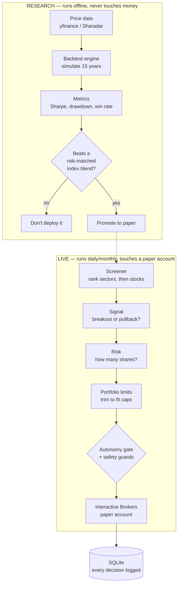
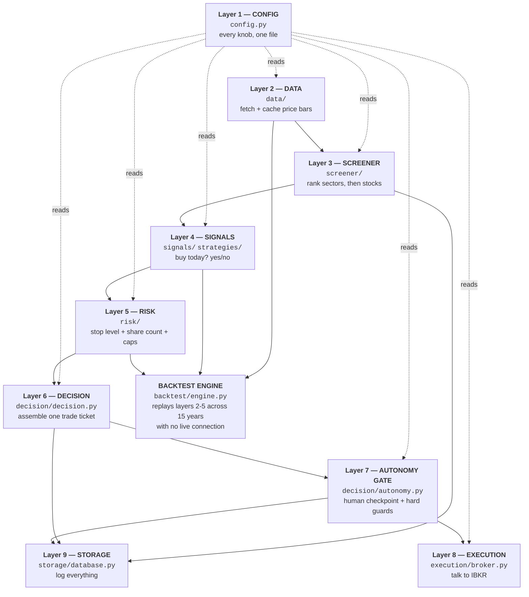
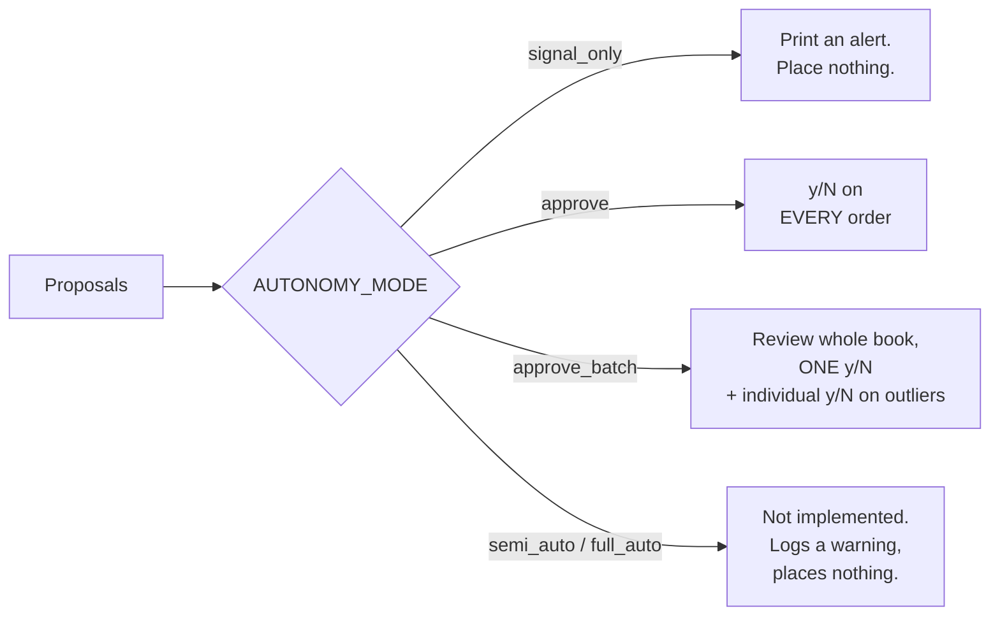
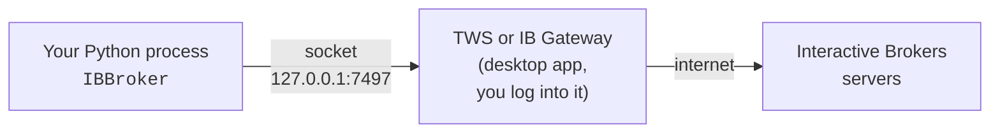
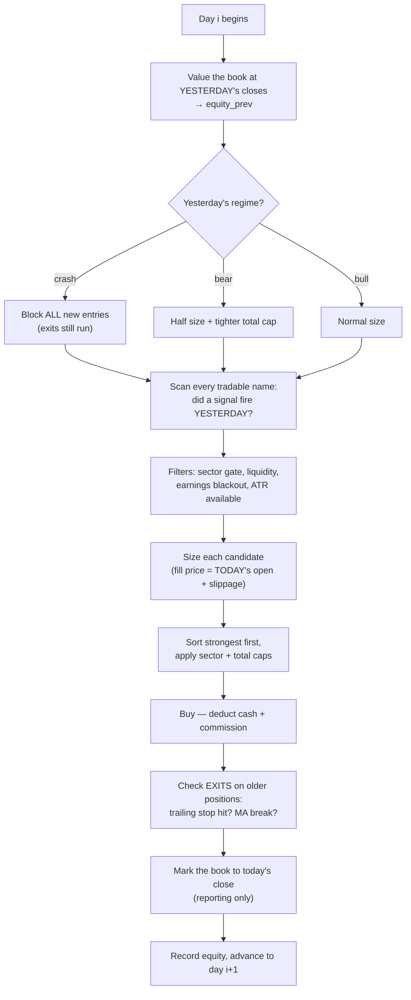
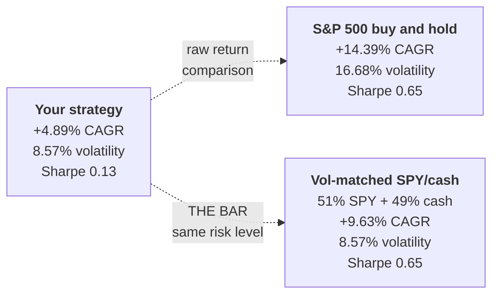
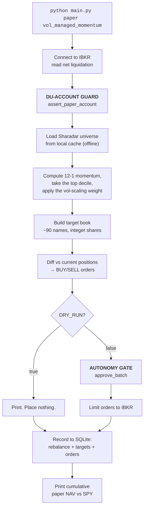

# The Swing Trading Agent — How It Actually Works

*A guided tour of the system, written to be understood rather than skimmed.*

---

## How to read this document

This is a teaching document, not an API reference. It assumes you know what a stock is
and roughly what "buy low, sell high" means, and nothing beyond that. Every piece of
jargon gets defined the first time it shows up.

It's organized in three parts:

| Part | What it covers | Read it when |
|---|---|---|
| **Part 1 — The Base System** | The original agent: how it finds stocks, decides to buy, sizes the bet, and places the order at Interactive Brokers | You want to understand the machine you built |
| **Part 2 — The Research Layer** | Everything that came after: factor testing, IC and t-stats, Sharadar data, combining factors, walk-forward validation, paper deployment | You want to understand *why* the edge hunt happened and how it was judged |
| **Part 3 — Reference** | Metrics glossary, your real results explained line by line, economic factors that matter, operator's guide, file map | You're actually running the thing |

Every chapter follows the same shape: **the idea → an analogy → the diagram → the actual
code → why it was built that way.** If you only read the analogies and diagrams, you'll
still come away with an accurate mental model.

A note on honesty: this document reports what the code does, including where the results
were disappointing. That's deliberate. A trading system that flatters itself is worse
than useless.

**About the numbers in this document.** Two kinds appear, and they are always distinguished:

- **Real** — read directly from your code or your saved run artifacts. Everything in
  *Part 3 → Your real results*, the canonical `1,675 trades / $1,967,830`, and every config
  value and code excerpt. These are facts about your system.
- **📋 Illustrative** — sample console output showing the *shape* of a report, with
  plausible but invented figures, used where re-running the pipeline wasn't part of writing
  this. Every one is tagged `📋 ILLUSTRATIVE FORMAT` with the command that produces the real
  thing. **Never quote these as results.**

---

## The 60-second version

Here is the entire system on one page.



**The one-sentence summary:** it screens the market top-down (strongest sectors first,
then the strongest names inside them), applies a simple mechanical entry rule, sizes each
position so a loss costs exactly 1% of the account, refuses to place anything without
passing two hard safety checks, and every strategy has to prove itself against a passive
index benchmark in a rigorous backtest before it's allowed anywhere near the broker.

**The honest headline, from your own saved results:** the base strategy earned +4.89% per
year over ~15 years against the S&P 500's +14.39%, with a Sharpe ratio of 0.13 against
the index's 0.65. It did not beat buying and holding the index. The system said so, in
plain English, in its own run summary. That's the system working correctly — most trading
ideas don't work, and the whole point of the machinery is to find that out for free
instead of finding it out with money.

---

# PART 1 — THE BASE SYSTEM

---

## Chapter 0: The mental model

Before any code, here's the analogy that makes the whole architecture click.

**Think of the system as a restaurant kitchen.**

- The **pantry** is your data layer. Raw ingredients arrive from suppliers (yfinance,
  Sharadar, Interactive Brokers). You don't cook with the supplier's truck — you unload
  into the pantry first, in a consistent format.
- The **prep station** is the screener. It narrows the whole world of ingredients down to
  the handful worth cooking with today.
- The **recipe** is the signal. Given prepped ingredients, does this dish get made or not?
  Yes/no. No opinions, just the recipe.
- The **portion control** is the risk layer. It doesn't care how good the dish is; it
  decides how much goes on the plate so nobody gets sick.
- The **expediter** is the decision layer. It assembles everything into a single ticket:
  what, how much, at what price, with what stop.
- The **head chef standing at the pass** is the autonomy gate. Nothing leaves the kitchen
  without passing them. They can refuse.
- The **waiter** is the broker connection. They carry the ticket to the table and nothing
  more — they don't second-guess the food.
- The **recipe test kitchen** is the backtest engine. New dishes are tested there for
  months before they ever appear on the menu.

The critical architectural rule, and the reason the code is laid out the way it is:
**each station does exactly one job and doesn't reach into another station's work.** The
recipe never decides portion size. The waiter never changes the recipe. This is why you
can swap the entry rule without touching the risk math, and why you can test a strategy in
the simulator with confidence that it behaves identically live.

---

## Chapter 1: The map — nine layers

Here is the whole base system, layer by layer, with the actual directory each one lives in.



Notice two structural facts:

1. **Config touches everything but nothing touches config.** There is exactly one place
   where a number like "risk 1% per trade" is defined. Change it there, and the live
   system, the backtest, and the tests all change together. This is what keeps the
   simulation honest — you can't accidentally backtest with different settings than you
   trade with.

2. **The backtest engine reuses the real layers.** It doesn't re-implement the entry rule
   or the sizing math. It imports `risk.position.size_position` and
   `risk.portfolio.apply_portfolio_limits` — literally the same functions the live path
   calls. This is a big deal. Most homemade backtesters lie because the simulated logic
   drifts from the live logic. Here it structurally can't.

---

## Chapter 2: Layer 1 — Configuration

**File:** `config.py` (161 lines, entirely constants and comments)

**The idea:** every tunable number in the system lives in one file, is read from an
environment variable, and has a documented default.

```python
RISK_PER_TRADE = float(os.getenv("RISK_PER_TRADE", "0.01"))   # risk 1% of equity per trade
ATR_MULTIPLE   = float(os.getenv("ATR_MULTIPLE",   "2.0"))    # stop = entry - 2 ATRs
MAX_POSITION_PCT = float(os.getenv("MAX_POSITION_PCT", "0.10"))  # no position over 10% of equity
IB_PORT = int(os.getenv("IB_PORT", "7497"))                   # 7497 = PAPER. 7496 = live.
DRY_RUN = _env_bool("DRY_RUN", False)                          # True = print, place nothing
```

**Analogy:** it's the settings panel on a machine, with the panel bolted to the outside
where you can see it — not a hundred dials hidden inside the housing.

**Why it matters more than it looks:** the most common way homemade trading systems blow
up is a number that means one thing in the backtest and another thing live. A `0.02` typed
into a backtest script that's `0.01` in the live runner. Centralizing removes that entire
category of bug.

### The settings that actually change behavior

Grouped by what they control, with the shipped defaults:

**How much you bet**
| Setting | Default | Plain English |
|---|---|---|
| `RISK_PER_TRADE` | `0.01` | A losing trade costs 1% of the account. This is *the* number. |
| `MAX_POSITION_PCT` | `0.10` | No single stock may be more than 10% of the account. |
| `MAX_SECTOR_PCT` | `0.30` | All tech names combined can't exceed 30% of the account. |
| `MAX_TOTAL_EXPOSURE` | `0.60` | At most 60% of the account is ever invested; 40% stays cash. |

**When you get in**
| Setting | Default | Plain English |
|---|---|---|
| `BREAKOUT_LOOKBACK` | `20` | Breakout = today's close beats the highest close of the last 20 days. |
| `PULLBACK_MA` | `50` | The trend line for the pullback rule is the 50-day average. |
| `PULLBACK_TOUCH_PCT` | `0.02` | Price must dip within 2% of that average to count as a pullback. |

**When you get out**
| Setting | Default | Plain English |
|---|---|---|
| `ATR_PERIOD` / `ATR_MULTIPLE` | `14` / `2.0` | Stop is placed 2 "average daily ranges" below entry. |
| `TREND_EXIT_ENABLED` | `True` | Once a trade is winning, switch to a looser trailing stop to let it run. |
| `CHANDELIER_ATR_MULT` | `3.0` | That looser stop trails 3 ranges below the highest price since entry. |

**Market conditions**
| Setting | Default | Plain English |
|---|---|---|
| `REGIME_FILTER_ENABLED` | `True` | Trade smaller when the market is in a downtrend. |
| `BEAR_SIZE_MULT` | `0.5` | In a bear market, every new position is half size. |
| `CRASH_BLOCK_NEW_ENTRIES` | `True` | In a crash, take no new positions at all. |

**Safety**
| Setting | Default | Plain English |
|---|---|---|
| `DRY_RUN` | `False` | If `True`, the system prints what it *would* do and places nothing. |
| `AUTONOMY_MODE` | `approve_batch` | You review the whole proposed book, then approve once. |
| `IB_PORT` | `7497` | The paper-trading port. The live port (7496) is never the default. |
| `LIMIT_BUFFER` | `0.005` | Orders are limit orders priced 0.5% through the market. |

---

## Chapter 3: Layer 2 — Data

**Files:** `data/prices.py`, `data/providers.py`, `backtest/data.py`, `data/earnings.py`

**The idea:** get clean daily price bars, cache them locally, and never let an incomplete
or future-looking bar into the system.

### What a "bar" is

One trading day of a stock is summarized in four numbers, called **OHLC**:

```
        High  $153.20  ← highest price traded that day
              │
    Open ────▶│  $150.00   ← first trade of the day
              │
              │◀──── Close  $152.10   ← last trade of the day
              │
        Low   $149.50  ← lowest price traded that day
```

Plus **Volume** — how many shares changed hands. Five numbers per stock per day. That's
all the price-based part of this system ever looks at.

### The three rules the data layer enforces

**Rule 1 — Adjusted prices only.** When a company splits its stock 2-for-1, the price
halves overnight. Raw data would show a -50% day that never happened. yfinance is called
with `auto_adjust=True`, which retroactively rewrites history so splits and dividends
don't create fake price moves:

```python
bars = yf.Ticker(symbol).history(start=..., end=..., interval="1d", auto_adjust=True)
```

**Rule 2 — No partial bars.** If you fetch data at 11am, today's "bar" is half-finished
and its close price is a lie. The fetcher drops any row with missing fields:

```python
bars = bars[OHLC_COLUMNS].dropna()   # a partial current-day bar shows up as NaN
```

This is a small line doing a big job. Without it, every signal computed intraday would be
comparing against a close price that hasn't happened yet.

**Rule 3 — Cache everything.** `backtest/data.py` fetches ~15 years of history per symbol
and writes it to a local Parquet file. Reruns read from disk. This makes a full backtest
take seconds instead of minutes and means research works with the internet off.

```
backtest/cache/
  AAPL.parquet     ← ~3,800 rows of daily OHLC
  MSFT.parquet
  SPY.parquet      ← the benchmark, also used for regime tagging
  ...
```

### The provider abstraction — a seam for the future

`data/providers.py` defines an abstract `DataProvider` with two methods:
`get_price_bars()` and `get_fundamentals()`. `YFinanceProvider` implements the first.
The second deliberately raises:

```python
def get_fundamentals(self, symbols, fields, start=None, end=None):
    raise NotImplementedError(
        "YFinanceProvider serves prices only; fundamentals need a point-in-time source.")
```

**Analogy:** it's a wall socket. Any appliance with the right plug works. Swapping
yfinance for a paid data vendor later is a one-class change, not a rewrite. This seam is
exactly what made the Sharadar upgrade in Part 2 possible without touching any strategy code.

The file also states the contract every provider must honor, and it's the most important
paragraph in the data layer:

> **POINT-IN-TIME CONTRACT:** the value returned for a given (symbol, field, date) must
> have been KNOWABLE at that date — no future revision and no look-ahead.

Hold that thought. Chapter 11 and Chapter 17 are both about what happens when you break it.

---

## Chapter 4: Layer 3 — The Screener

**Files:** `screener/momentum.py`, `screener/sectors.py`, `screener/stocks.py`, `screener/run_screener.py`

**The idea:** you can't analyze 5,000 stocks every day, and you shouldn't want to. Narrow
the field first — top-down.

### The funnel

```
              ALL US STOCKS  (thousands)
                     │
                     ▼
       ┌──────────────────────────────┐
       │  STEP 1: rank 11 sectors     │   XLK  +18.2%  ← Technology
       │  by momentum                 │   XLE  +14.7%  ← Energy
       │                              │   XLF  +11.3%  ← Financials
       └──────────────────────────────┘   XLV   +4.1%
                     │                    ...
                     ▼                    XLU   -2.8%  ← Utilities (skip)
       ┌──────────────────────────────┐
       │  STEP 2: keep the top 3      │   XLK, XLE, XLF
       └──────────────────────────────┘
                     │
                     ▼
       ┌──────────────────────────────┐
       │  STEP 3: rank the stocks     │   NVDA  +41.0%
       │  inside those 3 sectors      │   AVGO  +33.5%
       │  by the same measure         │   XOM   +22.1%
       └──────────────────────────────┘   ...
                     │
                     ▼
            RANKED WATCHLIST  (~23 names)
                     │
                     ▼
              saved to SQLite
```

**Analogy:** you're a scout looking for the fastest runner in the country. You don't time
every person. You find the three states producing the best runners, then time the runners
in those states. You'll miss the occasional fast kid in a slow state — that's an accepted
cost of not having infinite time.

### The momentum score

Both steps use the identical measure, defined once in `screener/momentum.py`:

```python
LOOKBACK_3M = 63    # trading days ≈ 3 months
LOOKBACK_6M = 126   # trading days ≈ 6 months

return_3m = close[-1] / close[-1 - 63]  - 1.0
return_6m = close[-1] / close[-1 - 126] - 1.0
momentum_score = (return_3m + return_6m) / 2.0
```

In words: *"How much is this up over the last 3 months, and over the last 6 months?
Average the two."* A stock up 10% over 3 months and 30% over 6 months scores 20%.

**Why average two windows instead of one?** A single window is fragile. A stock that
happened to gap up 4 months ago looks great on 6-month momentum and mediocre on 3-month.
Averaging demands the strength be *sustained* rather than a single lucky jump.

**Why momentum at all?** It's the single most persistently documented anomaly in equity
markets — winners over 3–12 months have historically kept outperforming for a few months
more. It shows up again in Part 2 as `momentum_12_1`, and it is, spoiler, the only signal
in this entire codebase that survives serious scrutiny.

### The sector universe

Eleven SPDR sector ETFs, one per slice of the economy:

| Ticker | Sector | | Ticker | Sector |
|---|---|---|---|---|
| XLK | Technology | | XLI | Industrials |
| XLF | Financials | | XLB | Materials |
| XLE | Energy | | XLU | Utilities |
| XLV | Health Care | | XLRE | Real Estate |
| XLY | Consumer Discretionary | | XLC | Communication Services |
| XLP | Consumer Staples | | | |

Each sector has a hardcoded shortlist of 7–8 large liquid constituents in
`screener/stocks.py` — `XLK` maps to `AAPL, MSFT, NVDA, AVGO, ORCL, CRM, AMD, ADBE`, and
so on. The code is explicit that this is a rough starting list, not real index membership.

**This is a real limitation, stated plainly.** ~85 hardcoded tickers that are today's
winners. Chapter 17 explains why that's a bigger problem than it sounds.

### What it outputs

*📋 ILLUSTRATIVE FORMAT — run `python screener/run_screener.py` for today's real ranking.*

```
=== Sector ranking (best momentum first) ===
symbol momentum_score return_3m return_6m
   XLK        +18.24%   +12.10%   +24.38%
   XLE        +14.71%   +19.02%   +10.40%
   XLF        +11.35%    +8.77%   +13.93%
   ...

=== Ranked watchlist ===
symbol sector momentum_score return_3m return_6m
  NVDA    XLK        +41.02%   +33.50%   +48.54%
  AVGO    XLK        +33.51%   +28.10%   +38.92%
   XOM    XLE        +22.14%   +25.80%   +18.48%
  ...
```

Every row is written to the `watchlist` table in SQLite, stamped with a run timestamp so
you can compare today's list against last week's.

---

## Chapter 5: Layer 4 — Signals

**Files:** `signals/base.py`, `signals/entry.py`, `signals/breakout.py`, `signals/pullback.py`, `signals/earnings_drift.py`

**The idea:** a signal answers exactly one question — *"Is there an entry today, yes or
no?"* It knows nothing about money, position size, or the account.

### The Strategy contract

Every strategy implements two methods that must agree with each other:

```python
class Strategy(ABC):
    name: str

    def generate_signal(self, bars, symbol=None) -> bool:
        """Is there an entry signal on the latest completed bar?"""

    def signal_series(self, bars, symbol=None) -> pd.Series:
        """The same rule, per bar, as a boolean series (for the backtester)."""

    def strength_series(self, bars) -> pd.Series:
        """How strong is the setup, 0..1? (for conviction sizing)"""
```

**Why two methods for one rule?** The live path checks one day at a time — that's
`generate_signal`. The backtester needs to check 3,800 days across 85 stocks, which is
323,000 checks; doing that one bar at a time in Python is painfully slow, so
`signal_series` computes all of them at once with vectorized pandas operations.

The danger is obvious: two implementations of one rule can drift apart, and then your
backtest is testing a strategy you don't actually trade. The codebase handles this by
making it a **tested invariant** — the test suite verifies `signal_series` equals
`generate_signal` bar by bar. The fast path is allowed to exist only because it's proven
equivalent to the slow one.

### Strategy 1: Breakout

```
price
  │                                        ● ← TODAY: close breaks above
  │                                       ╱     the 20-day high → BUY SIGNAL
  │  ┌─── highest close of prior 20 days ─┐
  │  │        ╱╲      ╱╲                  │
  │  │   ╱╲  ╱  ╲    ╱  ╲   ╱╲            │
  │  │  ╱  ╲╱    ╲  ╱    ╲ ╱  ╲  ╱        │
  │  └─────────────────────────────────────┘
  └──────────────────────────────────────────────▶ time
       ◀──────── 20 sessions ────────▶  today
```

```python
close = bars["Close"].dropna()
latest = close.iloc[-1]
prior_window = close.iloc[-(lookback + 1):-1]   # the 20 bars BEFORE today
return bool(latest > prior_window.max())
```

**The logic:** if a stock breaks to a one-month high, buyers have overwhelmed everyone who
wanted to sell at lower prices. Overhead supply is cleared.

**Read that slice carefully:** `[-(lookback+1):-1]`. The `-1` at the end excludes today.
If today were included in its own lookback window, today's close could never exceed the
maximum of a window containing itself, and the rule would never fire. That single character
is load-bearing, and it has a dedicated test.

**Strength** = how far past the high it broke, scaled so +5% over the prior high counts as
full strength (1.0). A stock closing 0.1% above the line is a weak breakout; one closing
6% above is a strong one.

### Strategy 2: Pullback

Breakout buys strength. Pullback buys a *dip inside* strength — three conditions, all
required:

```
price
  │                                    ● ← 3. BOUNCE: closing back up
  │           ╱╲                      ╱      (up vs yesterday AND up vs 3 days ago)
  │      ╱╲  ╱  ╲                    ╱
  │     ╱  ╲╱    ╲                  ╱
  │    ╱           ╲               ╱
  │   ╱             ╲___________  ╱  ← 2. PULLBACK: low came within 2% of the MA
  │  ╱ ~~~~~~~~~~~~~~~~~~~~~~~~~~~~~~~~~~~~ 50-day moving average
  │ ╱   ↑ 1. UPTREND: price above the 50-day average
  └────────────────────────────────────────────▶ time
```

```python
uptrend = close.iloc[-1] > moving_avg.iloc[-1]
touched = (low.iloc[-3:] <= moving_avg.iloc[-3:] * 1.02).any()
bounce  = close.iloc[-1] > close.iloc[-2] and close.iloc[-1] > close.iloc[-4]
return bool(uptrend and touched and bounce)
```

**The logic:** in an established uptrend, temporary dips to the trend line are where
short-term sellers exhaust themselves. You get a better entry price than chasing the
breakout — but only *after* the bounce confirms, so you're not catching a falling knife.

**Why have both?** They fire in different market conditions. Breakouts work in strongly
trending markets; pullbacks work in choppy uptrends. Running both gives more trades, and
more trades is how a small statistical edge gets a chance to show up (see Chapter 12).

### Strategy 3: Earnings drift

The third strategy trades the well-documented **post-earnings-announcement drift** — after
a company beats earnings expectations, the stock tends to keep drifting up for weeks.

The critical design constraint, enforced structurally:

> The signal fires on the session *strictly after* the report date, and the engine fills
> the entry at the *next* open — so the fill is always at least two sessions after the
> announcement. **The announcement is never traded through.**

Earnings gaps are the single largest overnight risk in single-stock trading. A stock can
open 25% lower with no chance to exit at your stop. This rule structurally cannot hold a
fresh position through one. There's a matching `EARNINGS_BLACKOUT` in the engine that
prevents *any* strategy from opening a position within 2 sessions of a known upcoming
report.

---

## Chapter 6: Layer 5 — Risk

**Files:** `risk/position.py`, `risk/portfolio.py`, `risk/conviction.py`

This is the layer that separates a trading system from a gambling system. The signal layer
has opinions; this layer has arithmetic.

### Step 1: Where does the stop go? (ATR)

You need a price at which you admit the trade is wrong. Put it too close and normal daily
noise stops you out. Too far and one loss hurts badly.

The answer is to measure each stock's own normal daily movement, using **ATR — Average
True Range**.

"True Range" for one day is the largest of three distances:

```
   ┌── today's high
   │        │
   │        │ ①  high − low          (today's full range)
   │        │
   ├── yesterday's close ····· ② |high − prev close|  (gap up + today's range)
   │        │                  ③ |low  − prev close|  (gap down + today's range)
   └── today's low
```

Options ② and ③ exist to catch overnight gaps — if a stock closes at $100 and opens at
$110 the next day, its "range" is really $10+, even though the intraday high-to-low might
be only $2. ATR is a 14-day smoothed average of that:

```python
true_range = max(high - low, |high - prev_close|, |low - prev_close|)
atr = true_range.ewm(alpha=1/14, adjust=False).mean()   # Wilder's smoothing
```

Then:

```python
stop = entry_price - 2.0 * atr    # ATR_MULTIPLE = 2.0
```

**Analogy:** ATR is a speed limit sign calibrated per road. A quiet residential street
(a utility stock) and a mountain highway (a biotech) both get a limit that makes sense for
*that road*. A fixed 5%-below-entry stop would be far too tight for the highway and
pointlessly loose for the street.

### Step 2: How many shares? (fixed-fractional sizing)

This is the most important calculation in the system, and it's four lines:

```python
risk_dollars    = equity * RISK_PER_TRADE          # 1% of the account
per_share_risk  = entry_price - stop_price         # $ lost per share if stopped
raw_shares      = floor(risk_dollars / per_share_risk)
max_shares      = floor((equity * MAX_POSITION_PCT) / entry_price)   # 10% cap
shares          = min(raw_shares, max_shares)
```

**Worked example — a calm stock:**

```
Equity            $1,000,000
Risk budget       $10,000            (1%)
Stock A           $100, ATR = $1     (calm)
Stop              $100 − 2×$1 = $98
Per-share risk    $2
Risk-based size   $10,000 / $2 = 5,000 shares  →  $500,000 position (!)
10% cap           $100,000 / $100 = 1,000 shares
FINAL             1,000 shares = $100,000       ← the CAP binds
Actual risk       1,000 × $2 = $2,000  (0.2% of equity)
```

**Worked example — a volatile stock:**

```
Equity            $1,000,000
Risk budget       $10,000            (1%)
Stock B           $100, ATR = $8     (wild)
Stop              $100 − 2×$8 = $84
Per-share risk    $16
Risk-based size   $10,000 / $16 = 625 shares  →  $62,500 position
10% cap           1,000 shares
FINAL             625 shares = $62,500          ← the RISK BUDGET binds
Actual risk       625 × $16 = $10,000  (1.0% of equity)
```

**Read those two examples side by side — this is the whole philosophy.** Both stocks cost
$100. The calm one gets 1,000 shares; the wild one gets 625. The system automatically buys
less of scarier things. You never have to think about it, and you can never talk yourself
into an oversized position on a name you feel good about.

The two caps do different jobs: the **risk budget** limits what a loss costs; the
**position cap** limits concentration even when the stop is tight.

### Step 3: Portfolio limits

Per-trade sizing is blind to the rest of the book. If eight tech breakouts fire on the
same day, eight individually-reasonable positions add up to an all-in bet on technology.

`risk/portfolio.py` processes proposals **strongest first** and trims each one to fit
whatever budget remains:

```
Equity $1,000,000        Sector cap: $300,000        Total cap: $600,000

  NVDA (XLK)  wants $100,000 → XLK used   $0 → fits      → BUY $100,000
  AVGO (XLK)  wants $100,000 → XLK used $100k → fits      → BUY $100,000
  AMD  (XLK)  wants $100,000 → XLK used $200k → fits      → BUY $100,000
  ADBE (XLK)  wants $100,000 → XLK used $300k → CAP HIT   → SKIP "portfolio limit: no room"
  XOM  (XLE)  wants $100,000 → XLE used   $0 → fits       → BUY $100,000
  ...
```

Three rules, in order:
1. **Sector cap** (30%) — cap tech at $300k regardless of how many tech signals fire.
2. **Total cap** (60%) — never more than $600k invested; $400k stays in cash.
3. **Minimum size floor** — after trimming, drop anything below both 10 shares *and* 1% of
   equity. This exists to sweep up the useless 3-share stubs that trimming leaves behind.

Critically, the running exposure is **seeded from positions you already hold**. If you're
already 25% in tech, only 5% of new tech room remains.

### Step 4: Conviction sizing (optional)

`risk/conviction.py` scales the 1% risk budget between 0.5× and 2× based on a 0–1
conviction score, the equal-weighted average of three things known at signal time:

- **Sector strength** — is this the #1 sector or the #3 sector?
- **Name momentum** — the stock's own 3/6-month blend, where +50% = full marks
- **Signal strength** — how decisively did the setup trigger?

**Worth noting: this is turned OFF in the canonical backtest** (`conviction_sizing=False`
in `main.py`'s `CANONICAL_FLAGS`). It's built, tested, and available, but the headline
numbers don't use it. That's a deliberate conservatism — every extra knob is another way to
accidentally fit the past.

---

## Chapter 7: Layer 6 — Decision

**File:** `decision/decision.py` (58 lines — the smallest important file in the repo)

This layer assembles everything into a single ticket. It is **pure logic** — no network
calls, no broker, no file writes. Give it the same inputs and it returns the same output
forever, which is what makes it trivially testable.

```python
def compute_decision(symbol, bars, equity) -> dict:
    if not breakout_signal(bars):
        return skip(symbol, "no breakout")

    atr = compute_atr(bars, ATR_PERIOD)
    if atr is None or atr <= 0:
        return skip(symbol, "ATR unavailable")

    entry_ref = latest_close(bars)
    stop = compute_stop(entry_ref, atr)
    shares, risk_dollars = size_position(equity, entry_ref, stop)
    if shares <= 0:
        return skip(symbol, "position sizes to zero shares")

    return {"status": "propose", "symbol": symbol, "action": "BUY",
            "entry_ref": ..., "stop": ..., "atr": ..., "shares": ...,
            "risk_dollars": ..., "est_value": ...}
```

**The key design choice: skips carry reasons.** The function never silently returns
nothing. Every rejection says *why* — `"no breakout"`, `"ATR unavailable"`,
`"position sizes to zero shares"`, `"portfolio limit: no room"`, `"below minimum size"`.

Why that matters, quoting the project plan directly:

> Log every decision the agent makes, including the ones it skips. The log is how you
> debug and how the ML phase learns.

If the system proposes nothing for a week, "no breakout × 23" and "portfolio limit × 23"
are completely different diagnoses. The first means the market is quiet; the second means
you're already fully invested.

### What it prints

*📋 ILLUSTRATIVE FORMAT — run `python main.py live` for real proposals.*

```
=== Proposals ===
symbol action  entry_ref     stop     atr  shares  risk_dollars  est_value
  NVDA    BUY     142.30   134.86    3.72     672      10000.00  95625.60
  AVGO    BUY     168.55   159.11    4.72     529      10000.00  89162.95

=== Skips ===
symbol                        reason
  AAPL                  no breakout
  MSFT                  no breakout
   AMD  position sizes to zero shares
```

---

## Chapter 8: Layer 7 — The Autonomy Gate

**File:** `decision/autonomy.py`

**This is the most safety-critical file in the codebase.** It is the single place where a
proposal becomes a real order. Nothing bypasses it.

### The two hard guards

Every path through the gate hits both of these, and they cannot be argued with:

```python
PAPER_ACCOUNT_PREFIX = "DU"   # IBKR paper accounts start with DU; live start with U

def is_paper_account(account_id):
    return bool(account_id) and account_id.startswith(PAPER_ACCOUNT_PREFIX)

def assert_paper_account(broker):
    account_id = broker.get_account_id()
    if not is_paper_account(account_id):
        log.error("SAFETY GUARD: account %r is not a paper (DU) account; refusing.", account_id)
        raise RuntimeError(f"Refusing to trade on non-paper account: {account_id!r}")
```

**Guard 1 — the DU check.** IBKR paper accounts are named `DU1234567`; live accounts are
`U1234567`. If the connected account doesn't start with `DU`, the gate raises and the
process aborts. It doesn't warn. It doesn't ask. It stops.

**Guard 2 — DRY_RUN.** If `config.DRY_RUN` is `True`, nothing is placed, period.

The guards are checked **three times** on the way to an order — once before the batch is
even displayed, once before placement begins, and once more immediately before each
individual order. This is defense in depth. If someone later refactors the outer check
away, the inner ones still hold.

`main.py` also asserts the guard's *logic* at startup, on every single run:

```python
assert is_paper_account("DU1234567") and not is_paper_account("U1234567") \
       and not is_paper_account(None)
```

So a bug that broke the paper check would fail the program before it could connect.

### The four autonomy modes



The last one deserves a mention: `semi_auto` and `full_auto` are named in the config
comments and in the project plan, but the code deliberately does **not** implement them:

```python
# semi_auto / full_auto are deliberately not implemented yet (Phase 5).
log.warning("Autonomy mode %r is not implemented yet; placing nothing.", mode)
```

Setting `AUTONOMY_MODE=full_auto` today does not unleash an autonomous trader. It places
nothing. Automation is earned after a real track record, not enabled by a typo.

### Batch mode and the outlier check

`approve_batch` exists because the portfolio strategy in Part 2 proposes ~90 orders at
once, and answering `y` ninety times is a checkbox ritual, not a safety control. So you
review the whole book in one table and confirm once:

*📋 ILLUSTRATIVE FORMAT.*

```
=== Proposed book (review before approving) ===
symbol  action   shares      limit     est_value  weight%
AAPL       BUY      120     201.45      24,174.00     2.4%
NVDA       BUY       88     142.98      12,582.24     1.3%
...
--------------------------------------------------------
Totals: 87 buys, 3 sells | gross $612,400 | 61.2% of equity  (weight% basis: equity)

3 order(s) exceed 2x the average size — each will need its own confirmation.

Place all 90 orders? [y/N]:
```

The clever bit is `_flag_outliers`. Batch approval creates a fat-finger risk — one order
for 10,000 shares instead of 100 hides inside a wall of text. So any order worth more than
2× the average order value **still** gets its own individual y/N, even inside the batch:

```python
threshold = BATCH_OUTLIER_MULT * mean_value      # 2x the average
return {i for i, p in enumerate(proposals) if p["est_value"] > threshold}
```

**Analogy:** it's the self-checkout at a supermarket. You scan your own groceries, but the
bottle of wine still summons a human. Convenience for the routine, friction for the risky.

---

## Chapter 9: Layer 8 — Execution (the broker)

**File:** `execution/broker.py`

**The idea:** a thin, boring wrapper around the Interactive Brokers API that does exactly
what it's told and reports what actually happened.

### How the connection works



This surprises people, so it's worth spelling out: **your code does not talk to IBKR over
the internet.** It talks to a desktop application running on your own machine — Trader
Workstation (TWS) or IB Gateway — which you have logged into manually. That app forwards
orders. Consequences:

- TWS/Gateway must be running before any broker command works.
- The API must be enabled in *Global Configuration → API → Settings*.
- Port **7497 = paper**, port **7496 = live**. The config default is 7497 and the DU guard
  is the backstop if that's ever wrong.

The library is `ib_async` (the maintained successor to `ib_insync`). It's asyncio
underneath, but its synchronous methods run their own event loop, so plain scripts work
without any async plumbing.

### Reconnection

```python
def _connect_with_backoff(self):
    delay = 1.0
    for attempt in range(1, self.max_retries + 1):     # 5 attempts
        try:
            self.ib.connect(host, port, clientId=..., timeout=10.0)
            ...
            return
        except Exception as error:
            time.sleep(delay)
            delay = min(delay * 2, 30.0)               # 1s, 2s, 4s, 8s, 16s (cap 30s)
    raise ConnectionError(...)
```

Waits 1s, then 2s, 4s, 8s, 16s. This is **exponential backoff** — a dropped connection is
usually transient, and hammering a server that's struggling makes it worse. Every operation
calls `ensure_connected()` first, which quietly reconnects if the session died.

### Why limit orders, not market orders

The system places **limit orders**, always. Two specific IBKR problems drove this, and both
are documented right in the code:

**Problem 1 — Error 354, "requested market data is not subscribed."** A paper account
without a live market-data subscription can't submit a market order, because IBKR has no
price to validate it against. A limit order carries its own price, so it goes through.

**Problem 2 — Error 10349, a TWS preset overriding the time-in-force.** Fixed by setting
`order.tif` explicitly on the order object so a desktop-app setting can't silently change it.

The price is set to be **marketable but protected**:

```python
sign = 1.0 if action == "BUY" else -1.0
limit_price = round(reference_price * (1.0 + sign * buffer), 2)   # buffer = 0.5%
```

Buying? Set the limit 0.5% *above* the current price. Selling? 0.5% *below*.

**Analogy:** it's a bid at an auction with a ceiling. "I'll pay up to $201, not a penny
more." You'll almost certainly get filled immediately at or below that, but if the stock
gaps to $230 in the next second, you don't buy at $230.

### Honest status reporting

This is a small thing that reflects a real discipline:

```python
trade = self.ib.placeOrder(contract, order)
self._log_order_status(trade, status_wait)   # wait 1.5s, then log the REAL status
```

The broker does **not** log "order placed!" and move on. It waits, then reports what
actually happened:

```
FILLED BUY 672 NVDA @ 142.31.
WORKING BUY 529 AVGO @ 169.39 (status=Submitted; not yet filled).
NOT WORKING BUY 200 XYZ @ 51.20: status=Cancelled — Error 201, Order rejected...
```

Submitting an order and having it accepted are different events. A system that conflates
them will happily tell you it built a portfolio it does not have.

---

## Chapter 10: Layer 9 — Storage

**File:** `storage/database.py` — SQLite, one file at `trading_agent.db`

Four tables:

| Table | What it holds |
|---|---|
| `watchlist` | Every screener run: timestamp, symbol, sector, momentum score, 3m/6m returns |
| `paper_rebalance` | One row per portfolio rebalance: equity, gross weight, autonomy mode, DRY_RUN flag, SPY level, order counts |
| `paper_target` | The target share count per name for that rebalance |
| `paper_order` | Every order generated: symbol, action, shares, estimated value |

Two design details worth noticing:

**Everything is timestamped and appended, never overwritten.** You can reconstruct what the
system believed on any past date. That's the difference between a log and a state file.

**`paper_rebalance` has a `live` flag.** It records whether the equity figure came from a
real broker NAV or from an offline preview's assumed number. When you later ask "how has
the paper strategy done versus SPY?", only rows with `live = 1` are used:

```sql
SELECT run_timestamp, equity, spy_level FROM paper_rebalance
WHERE strategy = ? AND live = 1 ORDER BY run_timestamp
```

That single flag prevents an offline dry-run from ever contaminating your track record with
a made-up account value. Small detail, enormous integrity value.

Why SQLite rather than Postgres: zero setup, one file, no server, trivially backed up. The
project plan names Supabase/Postgres as the upgrade when a remote dashboard is wanted.

---

## Chapter 11: The Backtest Engine — the time machine

**File:** `backtest/engine.py` (542 lines — the most intellectually demanding file in the repo)

**The idea:** replay 15 years of history day by day, making decisions using only what was
knowable on that day, and see what would have happened.

### The one enemy: look-ahead bias

**Look-ahead bias** is using information in your simulation that you couldn't have had at
the time. It is the reason 95% of amateur backtests show fantastic results and lose money
live.

**The classic example:** "buy at today's close if today's close is the highest of the month."
Sounds fine. But you don't *know* today's close until the market shuts — at which point you
can no longer buy at it. The backtest just bought at a price it couldn't have gotten.

Subtler versions are everywhere. Using a moving average that includes today's bar. Using a
company's revenue figure on the fiscal quarter-end date rather than the date it was
actually filed, six weeks later. Screening on a stock list that only includes companies
that still exist.

Every one of those makes your results better and your live trading worse.

### How the engine structurally prevents it

The core loop uses two indices, and the discipline is total:

```python
for i in range(start_index, n_days):
    p = i - 1        # p = the PRIOR completed bar. Signals may read ONLY p.
                     # i = today. We may only TRADE at today's open.
```

The file is annotated with `LOOK-AHEAD GUARD` comments at every place this matters. What
each one enforces:

```
        DAY p (yesterday)                    DAY i (today)
   ┌──────────────────────────┐      ┌──────────────────────────┐
   │ ✅ signal fires here     │      │ ✅ entry FILLS here      │
   │ ✅ ATR read here         │ ───▶ │    at the OPEN           │
   │ ✅ momentum read here    │      │                          │
   │ ✅ regime read here      │      │ ❌ today's close is      │
   │ ✅ equity valued here    │      │    NEVER used to decide  │
   │ ✅ liquidity read here   │      │    anything              │
   │ ✅ stop level set here   │      │                          │
   └──────────────────────────┘      └──────────────────────────┘
```

The five guarantees, quoted from the module docstring:

> * Decisions on day `i` read indicators only at `p = i - 1` (the prior completed bar).
> * Entries fill at day `i`'s OPEN, never the signal day's close.
> * Sizing equity and portfolio caps are valued at the prior close.
> * The trailing stop active during day `i` uses closes only through `p`.
> * Regime at entry is read at `p`.

The equity used for sizing is a good illustration:

```python
book_positions = [{"symbol": s, "shares": pos["shares"],
                   "market_value": pos["shares"] * pos["last_close"]}   # last_close = close[p]
                  for s, pos in book.items()]
equity_prev = cash + sum(bp["market_value"] for bp in book_positions)
```

Your account value for today's sizing is marked at *yesterday's* closing prices — which is
genuinely all you know at this morning's open.

Today's close *is* used for one thing only, and the code says why:

```python
# Marking the equity curve to close[i] is fine: it feeds reports, never a decision.
```

### What one simulated day looks like



### The cost model — why the results aren't flattering

Real trading costs money. The engine charges for it:

```python
COMMISSION_PER_SHARE = 0.005   # half a cent per share, IBKR-tiered-like
SLIPPAGE_PCT = 0.0005          # 5 basis points (0.05%), against you on BOTH sides
```

**Slippage** is the gap between the price you see and the price you get. It's charged
against you every time — buys fill slightly higher, sells slightly lower:

```python
entry_fill = open_i * (1.0 + slippage)   # you pay MORE
exit_fill  = raw    * (1.0 - slippage)   # you receive LESS
```

For research on smaller stocks there's a tiered model (`SLIPPAGE_BPS_LARGE=5`, `MID=15`,
`SMALL=40`) — thin stocks cost eight times more to trade than mega-caps, which is realistic
and is a major reason small-cap backtests that ignore costs look magical.

There's also a **liquidity filter** available: require ≥$5M average daily dollar volume and
≥$5 price, and cap any position at 1% of the stock's average daily volume. That last one
prevents the classic fantasy where a backtest "buys" more shares in a day than actually
traded.

### Market regime — three market weathers

`backtest/regime.py` labels every day from SPY alone:

```python
CRASH_DRAWDOWN = 0.15   # >15% off the recent high
CRASH_WINDOW   = 42     # ~2 trading months
TREND_MA       = 200    # 200-day moving average

regime = "bull"                                  # default
regime[close < moving_avg_200] = "bear"          # sustained downtrend
regime[drawdown <= -0.15]      = "crash"         # crash overrides bear
```

```
     bull                    bear                crash
  ╱╲    ╱╲╱               ╲                       ╲
 ╱  ╲╱╲╱      price        ╲╱╲                     ╲
━━━━━━━━━━━━━ 200-day MA ━━━━╲━━━━━━━━             ╲
                              ╲╱╲  ╱╲               ╲╲╲  >15% off
   price ABOVE the MA          ╲╱  ╲╱                 ╲╲╲  the 42-day high
                          price BELOW the MA
```

And the engine responds:

| Regime | Response |
|---|---|
| bull | Normal sizing, 60% total exposure cap |
| bear | Half-size new positions, tighten total cap to 30% |
| crash | **No new entries at all.** Exits still run normally. |

Note that exits always run. You never get trapped in a position because the market
condition turned off the trading logic.

### The trend-riding exit — how you let winners run

This implements the payoff-ratio philosophy from the project plan:

> Optimize the payoff ratio (avg win / avg loss), not the hit rate.

Positions have two lives:

```
PHASE 1 — not yet profitable        PHASE 2 — up more than 1 ATR ("trend mode")
────────────────────────────        ───────────────────────────────────────────
Standard trail:                     Chandelier trail:
  highest CLOSE − 2×ATR               highest HIGH since entry − 3×ATR
Tight. Cut losers fast.             Loose. Give the winner room to breathe.
                                    PLUS: exit if the close breaks
                                          below the 50-day average.
```

```python
if close_p - position["entry_price"] >= position["atr_entry"]:
    position["trend_mode"] = True    # latched — never goes back
```

Once latched, it stays latched. And the trailing stop **only ever ratchets upward**:

```python
position["current_stop"] = max(position["current_stop"], new_trail)
```

The stop can rise as the trade works; it can never be loosened. That prevents the single
most expensive human behavior in trading — moving your stop down because you don't want to
be wrong yet.

### Realistic exit fills

```python
if not np.isnan(open_i) and open_i < position["current_stop"]:
    raw = open_i                    # the stock GAPPED below your stop overnight
else:
    raw = position["current_stop"]  # normal fill at the stop
```

If a stock closes at $100 with your stop at $98 and opens the next day at $91, you don't
get $98. You get $91. The engine models that. This is exactly the scenario that makes
naive backtests overstate returns, and it's why gap risk (earnings!) is handled separately.

### The regression anchor

`main.py` runs an **integration self-check at startup on every subcommand**:

```python
CANONICAL_TRADES = 1675
CANONICAL_FINAL  = 1_967_830

assert len(trades) == CANONICAL_TRADES and abs(final - CANONICAL_FINAL) < 5000
```

The canonical configuration must produce exactly 1,675 trades and about $1,967,830 in final
equity. If a refactor changes a result by a dollar, the program refuses to start.

**Analogy:** it's the calibration weight you put on a scale before weighing anything
important. If the known 1kg block reads 1.02kg, you don't trust today's measurements.

---

## Chapter 12: Measuring honestly — the bar

**Files:** `backtest/metrics.py`, `backtest/risk_metrics.py`, `backtest/benchmark.py`, `backtest/evaluate.py`

Here's the question that most backtests dodge: **compared to what?**

"My strategy made 9% a year" means nothing alone. Against what? Over which years? Taking
how much risk?

### Three benchmarks, not one



**Benchmark 1 — Buy and hold SPY.** Same starting capital, same dates, dividend-adjusted.
"What if I had done nothing at all?"

**Benchmark 2 — The vol-matched SPY/cash blend.** This is the clever one, and it's the
actual bar. Your strategy holds a lot of cash and is therefore less volatile than the
market. Comparing a low-risk strategy to a full-risk index is apples-to-oranges. So the
code builds a passive blend at *your strategy's exact risk level*:

```python
def vol_matched_weight(strategy_equity, benchmark_equity):
    strat_vol = strategy_equity.pct_change().std()
    bench_vol = benchmark_equity.pct_change().std()
    return min(1.0, max(0.0, strat_vol / bench_vol))    # → 0.51 in your run
```

Your strategy's volatility was 8.57%; SPY's was 16.68%. Ratio = 0.51. So the fair
comparison is: **51% in SPY, 49% in cash earning the risk-free rate, rebalanced daily.**

That blend takes about five minutes to set up and requires zero ongoing effort. If your
strategy — 1,675 trades, a screener, a regime filter, an ATR stop system — can't beat *that*,
the machinery isn't earning its keep.

**Benchmark 3 — the index overlay variant.** Your strategy holds ~40% cash. What if that
cash sat in SPY instead of earning nothing? That's the `Strategy+overlay` column in your
results, and it's a fairer accounting of the strategy's *active* decisions.

### The bar, made structural

From `backtest/evaluate.py`:

> **THE BAR (made structural): a strategy passes only if it beats the risk-matched blend
> on Sharpe.**

```python
passed = (strat_m["sharpe"] is not None and blend_m["sharpe"] is not None
          and strat_m["sharpe"] > blend_m["sharpe"])
```

It's one boolean in code. It's not a judgment call made while looking at a chart, and there
is no way to argue with it after the fact. That's the entire point — the bar is set before
you see the number.

### The strategy library scorecard

Every registered strategy is scored against that bar automatically:

*📋 ILLUSTRATIVE FORMAT — run `python run_library.py` for your real scorecard. The
per-strategy figures below are invented; only the combined row's `FAIL` verdict matches
your saved results.*

```
=== Strategy library scorecard (bar = beat vol-matched SPY/cash blend on Sharpe) ===
       strategy category  trades   CAGR  Sharpe  Sortino  maxDD  alpha   beta  vs bar
       breakout    price     989  +3.9%    0.09     0.14 -12.1%  -2.1%   0.24    FAIL
       pullback    price     801  +4.2%    0.11     0.17 -10.8%  -1.9%   0.26    FAIL
 earnings_drift    event     213  +1.8%    0.04     0.06  -8.2%  -2.8%   0.11    FAIL
combined+selector    combo    1675  +4.9%    0.13     0.19 -12.0%  -1.9%   0.28    FAIL
```

Adding a strategy is one `@register` decorator; the harness picks it up and scores it with
no further work. And the run summary in `main.py` writes the verdict in plain language:

> **HEADLINE:** nothing here beats a simple S&P position on a risk-adjusted basis — treat
> this as honest research, not a live edge.

That sentence is generated from the computed numbers, not written by hand. The system is
built so it cannot flatter itself.

---

## Chapter 13: A day in the life — the full trace

Let's follow one decision from raw data to a placed order. *📋 The prices and symbols below
are a worked example — the mechanics, thresholds, and code paths are exactly what the
system does; the specific numbers are invented so the arithmetic is followable.*

**08:00 — the screener runs** (`python screener/run_screener.py`)

Fetches ~7 months of closes for 11 sector ETFs, computes momentum, ranks them. XLK is #1
at +18.24%. Fetches closes for the 8 tech constituents, ranks them. NVDA is #1 at +41.02%.
Writes 23 rows (3 sectors × ~8 names) to the `watchlist` table with today's timestamp.

**09:00 — the decision loop runs** (`python main.py live`)

1. **Connect.** `IBBroker.connect()` → TWS on 127.0.0.1:7497 → account `DU1234567`.
2. **Read equity.** `get_account_summary()` → `net_liquidation = $1,000,000`.
3. **Guard.** `assert_paper_account(broker)` → `DU1234567` starts with `DU` → passes,
   logs "Safety guard passed: paper account DU1234567 confirmed."
4. **Load watchlist.** 23 symbols from the most recent run.
5. **For each symbol** — fetch 120 days of OHLC, then `compute_decision`:

   For **NVDA**:
   - `breakout_signal(bars)` → close $142.30 vs prior-20-day high $141.10 → **True**
   - `compute_atr(bars, 14)` → **$3.72**
   - `compute_stop(142.30, 3.72)` → 142.30 − 2×3.72 = **$134.86**
   - `size_position(1_000_000, 142.30, 134.86)`:
     - risk budget = $10,000; per-share risk = $7.44
     - raw shares = floor(10000 / 7.44) = **1,344**
     - cap = floor(100,000 / 142.30) = **702**
     - final = **702 shares** ← the 10% cap binds
   - Returns a proposal: 702 shares, $99,894 value, stop $134.86.

   For **AAPL**: `breakout_signal` → False → skip, reason `"no breakout"`.

6. **Portfolio limits.** Proposals arrive in watchlist rank order (strongest first). The
   engine seeds exposure from your existing positions, then trims. Suppose you already hold
   $200,000 of tech: NVDA's $99,894 would take XLK to $299,894 — just under the $300,000
   sector cap. It fits. AVGO, next in line, gets trimmed to $106 of room, sizes to 0 shares,
   and is skipped with `"portfolio limit: no room"`.

7. **The gate.** `AUTONOMY_MODE=approve_batch`:
   - `assert_paper_account` runs **again**
   - the full book table prints with weights and totals
   - `DRY_RUN` is checked — if True, stop here
   - outliers flagged: NVDA at $99,894 vs an average order of $42,000 → **2.4× the average
     → flagged**, needs its own confirmation
   - `Place all 4 orders? [y/N]:` → you type `y`
   - NVDA prompts individually because it's an outlier → `y`

8. **The order.** `place_limit_order("NVDA", 702, "BUY", reference_price=142.30)`:
   - `assert_paper_account` runs a **third** time
   - limit price = 142.30 × 1.005 = **$143.01**
   - `order.tif = "DAY"` set explicitly
   - contract = `Stock("NVDA", "SMART", "USD")`, qualified with IBKR
   - `placeOrder` → wait 1.5s → log the real status:
     `FILLED BUY 702 NVDA @ 142.44.`

9. **Log.** Every step is timestamped in `logs/`; the watchlist and rebalance rows are in
   SQLite.

That's the whole base system, end to end.

---

# PART 2 — THE RESEARCH LAYER

---

## Chapter 14: Why the edge hunt started

Part 1's system works exactly as designed. The problem is what it found:

```
Strategy    CAGR +4.89%   Sharpe 0.13   maxDD -11.95%
S&P 500     CAGR +14.39%  Sharpe 0.65   maxDD -33.72%
Blend       CAGR +9.63%   Sharpe 0.65   maxDD -18.29%
```

The strategy lost to a passive index on both raw return *and* risk-adjusted return. It did
control drawdown well (-11.95% vs -33.72%), but the risk-matched blend achieved a better
Sharpe with none of the effort.

Two possible conclusions:
1. The idea (technical breakouts on large-cap momentum names) doesn't have an edge.
2. The idea is fine but the *inputs* are wrong — wrong universe, wrong signal, biased data.

The research layer is the systematic investigation of #2. And the tool it needed was one
the base system didn't have: **a way to test whether a signal predicts anything at all,
before spending days building a strategy around it.**

---

## Chapter 15: What a "factor" is

**File:** `factors/base.py`

A **factor** is a number you can compute for every stock on every day, such that ranking
stocks by that number tells you something about their future returns.

```
             Factor: momentum_12_1        Forward return (next month)
             ─────────────────────        ───────────────────────────
   NVDA            +0.82  (rank 1)                 +6.2%
   AVGO            +0.61  (rank 2)                 +3.8%
   AAPL            +0.34  (rank 3)                 +1.1%
   ...
   XYZ             −0.45  (rank 99)                −2.4%
   ABC             −0.71  (rank 100)               −5.9%

   Question: does the LEFT column predict the RIGHT column?
```

Every factor in the system produces a `date × symbol` grid of numbers:

```python
class Factor(ABC):
    name: str
    category: str          # "price" | "volume" | "fundamental"
    point_in_time_provider: bool = False

    def compute(self, data: FactorData) -> pd.DataFrame:
        """date x symbol values; value[t] uses only data <= t (no look-ahead)."""
```

And the simplest one is three lines:

```python
@register
class Momentum12_1(Factor):
    name = "momentum_12_1"
    def compute(self, data):
        # LOOK-AHEAD GUARD: shift(21)/shift(252) use only PAST closes.
        return data.close.shift(21) / data.close.shift(252) - 1.0
```

That's "12-1 momentum": the return from about 12 months ago to about 1 month ago.

**Why skip the most recent month?** Because short-term returns *reverse* — a stock that
jumped last week tends to give some back. Momentum works over 12 months but reverses over
1 month, and mixing them muddies the signal. Skipping the last month is standard practice
in the academic literature for exactly this reason.

### The factor library

**Price/volume factors** (`factors/library.py`), testable on free data:

| Factor | What it measures | Expected sign |
|---|---|---|
| `momentum_12_1` | 12-month return, skipping last month | + (winners keep winning) |
| `momentum_6_1` | Same, 6-month version | + |
| `short_term_reversal` | Negative of last week's return | + (last week's losers bounce) |
| `low_volatility` | Negative of 60-day volatility | + (calm stocks outperform) |
| `ivol_capm` | Idiosyncratic vol vs the market | − |
| `beta_low` | Negative of CAPM beta | + |
| `max_daily_return` | Biggest single-day gain in a month | − (lottery-ticket effect) |
| `ncskew`, `duvol` | Crash-risk skewness measures | − |
| `wq_alpha_101` etc. | WorldQuant formulaic alphas (Kakushadze 2016) | no prior |

**Fundamental factors** (`factors/fundamentals.py`), requiring paid point-in-time data:

| Factor | What it measures | Expected sign |
|---|---|---|
| `profitability` | Earnings relative to assets | + |
| `operating_profitability`, `gross_margin` | Quality of the business | + |
| `earnings_yield`, `fcf_yield`, `book_to_price` | Value — cheapness | + |
| `sales_growth`, `earnings_growth` | Growth | + |
| `accruals` | Earnings not backed by cash | − (a red flag) |
| `asset_growth` | Company ballooning its balance sheet | − |
| `debt_to_equity` | Leverage | − |

**The "expected sign" column is doing real work.** These signs come from the published
literature *before* any testing. Chapter 16 explains why that pre-commitment is the
difference between research and data mining.

---

## Chapter 16: The IC harness — judging a factor

**File:** `factors/evaluate.py`

This is the tool the whole research layer is built on. It answers one question cheaply:
**does this factor predict returns?** — without building a strategy, without a backtest,
without frictions.

### Information Coefficient (IC)

The procedure, once per month:

```
Step 1  On the last trading day of January, compute the factor for all 500 stocks.
Step 2  Rank the stocks by that factor:      NVDA #1, AVGO #2, ... , ABC #500
Step 3  Wait one month.
Step 4  Rank the same stocks by their actual February return.
Step 5  Ask: how similar are the two rankings?
```

That similarity is the **Spearman rank correlation**, and one month's value is one IC:

```python
ics.append(paired["f"].corr(paired["r"], method="spearman"))
```

| IC | Meaning |
|---|---|
| +1.00 | Perfect. Your #1 pick really was the best performer, straight down the list. |
| +0.05 | Weak but real, and genuinely good for a single equity factor. |
| 0.00 | No relationship at all. Coin flip. |
| −0.05 | Backwards — your top picks underperform. |

**Real-world calibration: an IC of 0.03–0.05 is a good factor.** Not 0.5. Markets are
mostly efficient; a tiny persistent edge applied to hundreds of names is what a real
quantitative firm runs on.

### Repeat 240 times

One month's IC is noise. Repeat for every month over 20 years and you get a *distribution*:

```
mean IC   = +0.032    ← the average edge
std IC    =  0.081    ← how much it bounces month to month
n         =  240      ← number of months tested
```

From those three numbers come the two summary statistics that matter:

**t-statistic — "could this be luck?"**

```python
t_stat = mean_ic / (std_ic / sqrt(n))
```

Plugging in: `0.032 / (0.081 / √240) = 0.032 / 0.00523 = 6.12`

**Analogy:** you flip a coin 240 times and get 128 heads. Is it rigged? The t-stat is
"how many standard errors away from zero is this result?" A t-stat above 2 means **less
than a 5% chance you'd see this by luck if the true effect were zero.**

**Information Ratio (IR) — "how consistent is it?"**

```python
ir = mean_ic / std_ic * sqrt(12)
```

`0.032 / 0.081 × 3.46 = 1.37`. This is roughly the Sharpe ratio of the factor's predictive
power — reward per unit of variability, annualized.

### Decile spread — the tradability check

IC is a correlation, which is abstract. The decile spread is concrete:

```
   Sort all 500 stocks by the factor, cut into 10 buckets of 50.
   Measure each bucket's average return over the next month.

   Decile 10 (best factor score)   +1.42%   ← you'd go LONG these
   Decile 9                        +1.11%
   Decile 8                        +0.98%
   ...                                        A clean monotonic ladder is the
   Decile 2                        +0.31%     sign of a real effect.
   Decile 1 (worst factor score)   +0.18%   ← you'd go SHORT these
   ─────────────────────────────────────
   TOP MINUS BOTTOM (the spread)   +1.24%/month
```

That spread is what a long/short portfolio would earn before costs. The harness also
reports its Sharpe ratio (`tmb_sharpe`).

### The bar

**File:** `factors/run_factor_eval.py`

```python
IC_THRESHOLD = 0.02
TSTAT_THRESHOLD = 2.0

def _verdict(score):
    return "BUILD" if (abs(ic) > IC_THRESHOLD and abs(t) > TSTAT_THRESHOLD) else "no signal"
```

Both conditions, always: the effect must be **big enough to matter** (|IC| > 0.02) *and*
**unlikely to be luck** (|t| > 2). Either one alone is insufficient. A tiny effect measured
very precisely isn't worth trading; a big effect measured over 12 months could easily be
noise.

### The multiple-testing problem — and the sign filter

Here's the trap that catches almost everyone. If you test 22 factors at |t| > 2, and *none*
of them work:

```python
expected_false = n_tested * 0.0455   # P(|t| > 2) ≈ 4.55% under the null
```

**You expect about one to pass anyway.** Purely by luck. That's what a 5% significance
threshold *means*.

The system prints this warning itself, in every run (*📋 counts illustrative; the 4.55%
and the wording are real*):

```
=== Multiple-testing reality check ===
  - 22 factors tested at |t|>2; under the null ~1 in 22 (4.55%) passes by chance,
    so ~1.0 false positives are EXPECTED even if nothing works.
  - 3 factors actually cleared the bar. A correct economic SIGN is the extra filter
    that separates a real effect from a lucky draw.
```

And the extra filter is the `EXPECTED_SIGN` table from Chapter 15. A factor must clear the
statistical bar **and** point the direction theory says it should. A factor that's
statistically significant in the *wrong* direction gets flagged, loudly:

```
  ! low_volatility    IC=-0.0281  t=-2.34  (prior +)
    WRONG-SIGNED passers (significant but opposite the prior => likely artifact,
    NOT a tradeable signal)
```

**Analogy:** you test 20 herbal remedies for headaches. One shows a statistically
significant effect — it makes headaches *worse*. Do you sell it as a headache cure with the
sign flipped? No. You conclude your sample has something weird in it. That's exactly the
reasoning here, and in this codebase the "something weird" turned out to be survivorship
bias (Chapter 17).

### The leakage rule, stated once

The harness is explicit about the one asymmetry that makes any of this valid:

> * Factor **VALUES** on date `t` use only data ≤ `t`.
> * Forward **RETURNS** are labels and may use the future: `close[t] → close[t_next]`.
> * **Labels are allowed to look ahead; factor values are not.**

This is the single most important sentence in the research layer. Of course the answer key
comes from the future — that's what makes it an answer key. But the student's inputs must
come only from the past.

---

## Chapter 17: The two silent killers

The project plan named them on day one:

> Look-ahead bias and overfitting are the two silent killers.

Here's the third, which turned out to be the one that mattered most.

### Killer 1: Look-ahead bias

Covered in Chapter 11. The engine prevents it with the `p = i - 1` discipline; the factors
prevent it with backward-only `shift()` and `rolling()` operations.

And it's *verified*, not just asserted, by a property test:

```python
def assert_filing_date_safety(data, factor_name="profitability"):
    """The value at the cutoff must be IDENTICAL when future bars are deleted."""
    full = factor.compute(data).loc[cutoff]
    truncated = FactorData(... every panel sliced to [:cutoff] ...)
    trunc = factor.compute(truncated).loc[cutoff]
    assert (full - trunc).abs().max() < 1e-9, f"FILING-DATE LEAK in {factor_name}"
```

**The logic is beautiful in its simplicity:** if a factor's value on June 1st genuinely
uses only data through June 1st, then deleting everything after June 1st can't change it.
If the number moves, the factor was peeking. This is a *proof*, not a code review.

### Killer 2: Overfitting

Overfitting is finding a rule that explains the past perfectly and the future not at all.
Test 500 rules on the same 15 years and one will look spectacular by chance.

The defenses in this codebase:

- **Parameters are documented as untuned.** From `config.py`: *"All values are research
  defaults; none were tuned to the result."*
- **Chronological train/test splits.** `factors/combine_train.py` splits by *date*, never
  randomly, and asserts it: `assert train["date"].max() < test["date"].min()`.
- **Scalers fit on training data only.** Even the standardization statistics don't get to
  see the test period.
- **Ridge regularization with a fixed, un-tuned alpha** (`RIDGE_ALPHA = 1.0`).
- **The economic-sign filter** — a rule with no theoretical justification is presumed to be
  data mining.
- **Walk-forward validation** (Chapter 21), which is the real test.

### Killer 3: Survivorship bias — the one that mattered

This one is subtle and it invalidated most of the early results.

Your universe is 85 hardcoded tickers: AAPL, MSFT, NVDA, JPM, XOM… **Every one of them
still exists today.** That's why you could type them from memory.

```
   What you tested:                    What was actually there in 2010:
   ┌──────────────────┐                ┌──────────────────────────────────┐
   │ AAPL   ✅ alive  │                │ AAPL       ✅ still here         │
   │ MSFT   ✅ alive  │                │ MSFT       ✅ still here         │
   │ NVDA   ✅ alive  │                │ NVDA       ✅ still here         │
   │ JPM    ✅ alive  │                │ LEHMAN     ❌ bankrupt 2008      │
   │ XOM    ✅ alive  │                │ SEARS      ❌ bankrupt 2018      │
   └──────────────────┘                │ BEAR ST.   ❌ collapsed 2008     │
                                       │ GE         ⚠️  −80%, still here  │
   100% survivors                      └──────────────────────────────────┘
```

**Every backtest on that list is a backtest on companies you already know survived.** The
returns are inflated. And the distortion isn't uniform — it hits *risk* factors hardest,
because the companies that vanished were disproportionately the volatile, indebted,
high-beta ones. Delete the failures and "high volatility" stops looking dangerous.

This is exactly what the results showed. The `low_volatility`, `beta_low`, `ivol_capm`, and
`max_daily_return` factors all came out with **inverted signs** — the code calls them the
"risk cluster" and tracks whether broadening the universe fixes them:

*📋 ILLUSTRATIVE FORMAT — run `python main.py factors` for the real IC values. The
*direction* of the finding (inverted signs that weakened but didn't flip) is real and is
what the code's own verdict text reports.*

```
=== Risk-factor cluster: does broadening fix the inverted signs? ===
       factor expected_sign  large_IC  broad_IC broad_sign_ok moved_toward_expected
   ivol_capm              -   +0.0312   +0.0198            no                   yes
    beta_low              +   -0.0287   -0.0154            no                   yes
low_volatility            +   -0.0341   -0.0203            no                   yes
```

Widening from 85 names to 300+ moved every one of them *toward* the expected sign but
didn't flip any. Diagnosis, stated in the code's own output:

> Broadening WEAKENED the inverted risk-factor signs toward their expected direction but
> did NOT reverse them. That is consistent with large-cap concentration inflating the
> inversion, yet leaves survivorship bias unresolved.

The only real fix is data that includes the dead companies. Which is what you bought.

---

## Chapter 18: Sharadar — buying honest data

**Files:** `data/sharadar_provider.py`, `data/archive_sharadar.py`, `backtest/universe.py`

Three tables from Sharadar (via Nasdaq Data Link) solve three distinct problems.

### Table 1: SHARADAR/TICKERS — the survivorship fix

A symbol master **including delisted companies**, with first and last price dates. You can
now reconstruct what the investable universe actually looked like on any historical date —
Lehman Brothers included, right up until it wasn't.

```python
SHARADAR_MAX_SYMBOLS = 1500   # the most-liquid survivorship-free US common stocks
tickers = select_liquid_sharadar_universe(provider, max_symbols=SHARADAR_MAX_SYMBOLS)
```

### Table 2: SHARADAR/SEP — daily prices for all of them, including the dead ones.

### Table 3: SHARADAR/SF1 — the point-in-time fix

This is the one worth paying for, and the reason is one column.

A company's Q1 results cover January–March. But they're not *filed* until mid-May. Between
those dates, nobody knows the numbers.

```
   Jan 1 ──────── Mar 31 ──────────────── May 15 ────────▶
                     │                       │
                     │                       └─ datekey       ← WHEN IT WAS FILED
                     └───────────────────────── calendardate  ← the period it covers

   Using calendardate leaks ~6 WEEKS of future information into every factor.
```

The provider keys everything to `datekey`, and the docstring is emphatic about why:

> We use dimension `ARQ` (As-Reported Quarterly) and key every value to its `datekey` (the
> SEC **FILING** date), NOT `calendardate` (the fiscal period end). **This is the entire
> point of paying.** Using `calendardate` would leak weeks-to-months of future information.

`build_fundamental_panels` places each filing's value on its filing date and forward-fills
from there. So `fundamentals["revenue"].loc["2015-04-20"]` returns whatever was the latest
*publicly filed* revenue as of April 20th, 2015 — not the quarter that had already ended but
wasn't announced yet.

**Analogy:** it's the difference between "what happened in the game" and "what had been
reported on the news by the time you placed your bet." Only the second one is a fair test
of your handicapping.

### Two operational touches worth stealing

**Stub mode.** If no API key is present, the provider constructs fine but every real data
call raises `SharadarUnavailable` with a descriptive message. That let the entire
pipeline — provider, factors, universe selection, harness, tests — be built and verified
*before* the subscription existed. Only the final numbers were gated on the key.

**The offline archive.** `data/archive_sharadar.py` bulk-downloads every table to local
Parquet once:

```bash
python data/archive_sharadar.py            # archive all tables
python data/archive_sharadar.py --verify   # PROVE cache-only mode hits no API
```

After that, `cache_only=True` is the default and the research pipeline runs with **zero API
calls**. Your research keeps working after the subscription lapses. `--verify` exists
specifically to prove there's no hidden network dependency.

---

## Chapter 19: Combining factors into a strategy

**Files:** `factors/composite.py`, `factors/combine_train.py`, `ml/combine_train.py`

Once the honest scorecard ran on point-in-time, survivorship-free data, exactly **two**
factors were individually significant, correctly signed, and economically distinct:

- **`momentum_12_1`** — a price signal
- **`profitability`** — a fundamental signal

### Why combining these two specifically is legitimate

This is a subtle but important point about research integrity. Combining factors is
usually how you overfit — try enough weightings and something will look great.

The justification here is stated up front, before any results:

> Price and fundamental signals are nearly uncorrelated by construction, so combining them
> is the legitimate, non-overfit diversification case — NOT data mining.

Two signals from genuinely different information sources should diversify. Two price
signals mostly just re-measure the same thing.

### The untuned combination

```python
# DELIBERATELY UNTUNED. Fixed 50/50, NO weight fitting: tuning weights to the scorecard
# would just overfit the very results we are trying to validate.
```

Two equally simple rules, both parameter-free:

```
  ZSCORE MODE                            RANK MODE
  ───────────                            ─────────
  For each date:                         For each date:
    momentum   → z-score across names      momentum   → percentile rank 0..1
    profitability → z-score                profitability → percentile rank 0..1
    score = (z_mom + z_prof) / 2           score = (r_mom + r_prof) / 2
```

Both normalizations are **cross-sectional** — computed within a single date's column of
names. No time-series information crosses dates, so the look-ahead safety of the components
carries through automatically.

One more detail: a stock is scored only if **every** component is present. The composite
genuinely requires both signals, rather than degrading into whichever one happens to have
data.

### The bar, again set in advance

From `ml/combine_train.py`, before any result was computed:

> The composite must:
> 1. beat **BOTH** standalone factors' IC (full history), **and**
> 2. clear the IC bar (|IC| > 0.02, |t| > 2) **out of sample** (last ~30%), **and**
> 3. beat passive (SPY buy-hold and the vol-matched blend) **after realistic costs**.

Three hurdles, all specified before seeing a number. This is the discipline that separates
research from storytelling.

### The Ridge alternative

`factors/combine_train.py` also fits a proper **Ridge regression** — a linear model that
predicts next month's return from all the curated factors at once, with a penalty that
keeps coefficients small so no single factor dominates.

Its most interesting output isn't the prediction; it's the **coefficient audit**:

*📋 ILLUSTRATIVE FORMAT — run `python factors/combine_train.py` for real coefficients.*

```
=== Combined-model coefficients (sign vs economic prior) ===
        factor    coef coef_sign expected prior_consistent
 momentum_12_1  +0.031         +        +             yes
 profitability  +0.024         +        +             yes
low_volatility  -0.019         -        +              no       ← leaning on an artifact
     accruals   -0.011         -        -             yes

  Prior-consistent weight: 74% of |coef| leans the theory-expected way.
```

That last line is a one-number honesty check: *how much of this model is riding on factors
whose signs disagree with theory?* If a model earns its performance from the inverted
survivorship artifacts, it's fitting a data bug, not a market phenomenon. 74% consistent
means most of it is real; 30% would be a red flag.

---

## Chapter 20: Vol-managed momentum — the one survivor

**Files:** `ml/momentum_variants.py`, `strategies/vol_managed_momentum.py`

Momentum was the one factor that cleared every bar. But momentum has a famous, brutal flaw.

### Momentum crashes

Momentum works quietly for years, then loses 40% in two months. It happens at market
*reversals*: after a crash, momentum is short the beaten-down names and long the defensive
ones. When the market violently rebounds, the beaten-down names rip upward and the momentum
book gets destroyed from both sides. Spring 2009 is the textbook case.

```
   momentum
   returns  │      ╱╲    ╱╲╱╲    ╱╲                         ╱╲    ╱╲
            │  ╱╲╱    ╲╱      ╲╱    ╲                     ╱    ╲╱
            │╱                        ╲                 ╱
            │                          ╲               ╱
            │                           ╲             ╱
            │                            ╲___________╱   ← the 2009 momentum crash
            └───────────────────────────────────────────────────▶
                     calm years              reversal
```

### Pre-specifying the fixes — no mining

`ml/momentum_variants.py` tests five variants **head to head, all specified in advance**:

| Variant | What it is |
|---|---|
| A. `momentum_12_1` | Baseline |
| B. `vol_managed_momentum` | Barroso & Santa-Clara (2015): scale exposure inversely to momentum's own recent volatility |
| C. `mom_plus_value` | Equal z-score blend with the strongest value factor |
| D. `mom_plus_quality` | Equal z-score blend with profitability |
| E. `risk_managed_quality_mom` | Vol management applied to D |

And it says why the result should be expected to be modest:

> These are all **WELL-KNOWN** fixes, so any surviving edge is expected to be modest, not
> hidden alpha.

That's the right posture. If a published 2015 paper's technique produced 3.0 Sharpe on your
laptop, the correct reaction is to look for the bug.

### How the vol overlay works

**The observation:** momentum crashes are *predictable in one specific way* — they happen
when momentum's own volatility is already elevated. So shrink the bet when things get wild.

```python
def vol_target_weights(returns, train_end, window, cap):
    realized = returns.rolling(window).std()
    target = realized[realized.index < train_end].median()   # fixed from TRAIN only
    return (target / realized.shift(1)).clip(upper=cap)
```

```
   Recent momentum vol   →   Gross exposure
   ─────────────────────     ──────────────
   Very calm (half normal)   200%  ← capped at leverage_cap = 2.0
   Normal                    100%
   Elevated (2× normal)       50%
   Wild (4× normal)           25%  ← the crash regime; you're mostly out
```

**Two look-ahead guards, both flagged in the code:**

1. `realized.shift(1)` — this month's weight uses only volatility realized *before* this
   month.
2. The constant `target` is the median trailing vol over the **training window only**,
   strictly before `train_end`. So a test period is scaled by a target fixed from its past.

Guard #2 is subtle and easy to get wrong. If you set your vol target using the full sample
median, you've used the future to calibrate the past — a leak that would flatter every
result. The code fixes the target before the test window begins.

**Analogy:** it's cruise control that reads the road surface. On dry pavement it holds
speed; when the road gets slick it eases off *before* the corner, using only what the
sensors have already seen — not a weather forecast.

### The two variants

```python
long/short  — long the top decile, short the bottom decile, vol-scaled
long-only   — long the top decile only, vol-scaled, remainder in cash earning the risk-free rate
```

The long-only version exists because paper (and most retail) accounts can't easily short.
**That's the variant deployed to paper.**

### Portfolio construction

Notice what `paper_book()` explicitly refuses to do:

```python
# We intentionally do NOT use the 1%-risk `size_position` here — that sizer is for the
# few-name breakout book and would grossly over-allocate a ~90-name decile, i.e. a
# different strategy than the one that survived walk-forward.
per_name_weight = min(gross / len(names), config.MAX_POSITION_PCT)
```

This is exactly right and easy to get wrong. The strategy that survived validation was an
**equal-weight decile portfolio**. Deploying it with a different sizing rule would deploy a
strategy that was never tested. The existing 10% per-name cap still applies as a backstop.

---

## Chapter 21: Walk-forward — the real robustness test

**File:** `backtest/walkforward.py`

A single train/test split can get lucky. Your 30% holdout might just happen to be a
momentum-friendly stretch.

**Walk-forward validation** slices the entire history into **non-overlapping** windows and
tests each one out-of-sample:

```
1998 ─────────────────────────────────────────────────────────────── 2026
     ├────────┤ TRAIN                                                       (window 1 setup)
              ├────────┤ TEST  2001-2004
                       ├────────┤ TEST  2004-2007
                                ├────────┤ TEST  2007-2010   ← includes the GFC
                                         ├────────┤ TEST  2010-2013
                                                  ├────────┤ TEST  2013-2016
                                                           ├────────┤ ... etc

Each window's vol target comes ONLY from data strictly BEFORE that window.
Nothing is ever chosen by looking at a test window.
```

```python
WINDOW_YEARS = 3

for start, end in windows:
    ret = strategy.portfolio_returns(data, eligible,
                                     train_end=start,   # target fixed from BEFORE the window
                                     start=start, end=end)
```

**Why this is the real test:** you're not asking *"did it work?"* You're asking *"how often
does it work, and how bad is the worst case?"* A strategy with Sharpe 1.2 that's positive in
9 of 9 windows is a fundamentally different animal from one with Sharpe 1.2 that made
everything in a single lucky window.

### What it reports

*📋 ILLUSTRATIVE FORMAT — run `python main.py strategy vol_managed_momentum` for the real
window table. The summary counts quoted at the end of this chapter (9/9 positive, 5/6 on
return) come from the code's own header and are real.*

```
=== Walk-forward (non-overlapping OOS windows, after costs) ===
   window  months   CAGR  Sharpe  Sortino  maxDD  SPY_Sharpe  beat_SPY  beat_EWmkt
2001-2004      36  +8.2%   +0.61    +0.88 -14.2%         n/a       n/a           Y
2004-2007      36  +6.4%   +0.52    +0.71 -11.0%         n/a       n/a           Y
2007-2010      36  +1.1%   +0.09    +0.13 -18.4%         n/a       n/a           Y
2010-2013      36  +9.8%   +0.74    +1.02 -12.7%       +0.68         Y           Y
...

Windows: 9 | Sharpe distribution: min +0.09, median +0.52, max +0.81; 9/9 positive.
Beat SPY (where SPY exists, 6 windows): 4/6 on Sharpe, 5/6 on return.
WORST window: 2007-2010 -> Sharpe +0.09, maxDD -18.4%, CAGR +1.1%.
```

**The WORST window line is the most valuable output in this entire document.** Average
performance is a marketing number. The worst window is what you actually have to survive
before you lose faith and turn the system off.

### The capacity check

*📋 ILLUSTRATIVE FORMAT — the turnover, ADV, and capacity figures below are invented to
show the shape of the report. The 5/15/40 bps tiers and the 1% ADV cap are real config
values.*

```
--- Capacity / turnover (honest order-of-magnitude) ---
  Annual one-way turnover (long leg): ~340% of the book per year.
  Median name ADV in universe: $18,400,000/day; ~90 names per decile.
  At 1% ADV participation, rough capacity ceiling ~$16,560,000 per side.
  Costs scale UP on smaller names (5 / 15 / 40 bps by tier); a real book skewed to
  thin names pays the small-tier rate, so the 15 bps/side here is optimistic at scale.
```

Monthly momentum deciles turn over heavily — you replace much of the book several times a
year, and every turn pays costs. This is why a strategy can have a genuine edge and still
not be worth running. The code computes and prints your actual figure, unprompted, along
with the warning that its 15 bps/side assumption is "optimistic at scale."

### The verdict recorded in the code

From the header of `decision/run_paper_strategy.py`:

> Walk-forward: **positive Sharpe 9/9 windows, beat market on return 5/6, ~flat through the
> GFC** — a modest, robust-but-not-Sharpe-dominant strategy. Collecting live evidence —
> **NOT a confirmed edge.**

That framing is correct and worth preserving. Robust across windows, survived 2008,
beats the market on return most of the time — but *not* dominant on risk-adjusted return.
Worth paper-trading, not worth betting the account on.

*(Note: I read these figures from the code's own header; I did not re-run the walk-forward
in this session. Running `python main.py strategy vol_managed_momentum` reproduces them.)*

---

## Chapter 22: Paper deployment on IBKR

**File:** `decision/run_paper_strategy.py`

The final step: take the strategy that survived walk-forward and run it, monthly, against
the paper account — **through the exact same safety machinery as everything else.**



### The diff-to-orders step

You don't liquidate and rebuild every month. You compute the difference:

```python
for symbol in sorted(set(target) | set(current)):
    delta = target.get(symbol, 0) - current.get(symbol, 0)
    if delta == 0:
        continue
    orders.append({"symbol": symbol,
                   "action": "BUY" if delta > 0 else "SELL",
                   "shares": abs(delta), ...})
```

Hold 100 shares of NVDA, want 140 → BUY 40. Hold 200 of AMD, want 0 → SELL 200. Only the
delta trades, which is what keeps that 340% turnover from becoming 800%.

There's a nice defensive detail: for a held name that has dropped out of the cached
universe, the reference price falls back to the position's own per-share market value, so
**every exit still gets a price-protected limit order** rather than a naked market order.

### What one cycle prints

*📋 ILLUSTRATIVE FORMAT — the header text and guard block are verbatim from the code; the
holdings, orders, and track-record figures are invented.*

```
====================================================================================
MONITORED PAPER VALIDATION — vol_managed_momentum (LONG-ONLY vol-managed momentum)
====================================================================================
This is forward paper validation of a MODEST, robust-but-not-Sharpe-dominant strategy
(walk-forward: positive Sharpe 9/9 windows, beat market on return 5/6, flat through the
GFC). Collecting live evidence — NOT a confirmed edge. LIVE broker.

--- Safety-guard status (unchanged existing guards) ---
  DU-account guard : PASSED DU1234567
  DRY_RUN          : False  (ARMED — gate will prompt)
  Autonomy mode    : approve_batch

--- Target portfolio (as of 2026-06-30; equity $1,000,000) ---
  Vol-scaling gross exposure: 87% (Barroso-Santa-Clara), 91 names, $870,000 invested.
symbol  target_shares  price  est_value  weight_%
  AAPL             47  201.4       9467      0.95
  NVDA             67  142.3       9534      0.95
  ...
  ... and 76 more names.

--- Orders to reach target (from 88 current position(s)) ---
symbol action  shares  est_value
  ABNB   SELL      31      4820
  AMD     BUY      52      7930
  ...
  34 buys, 29 sells.

=== Cumulative LIVE paper track record (vs SPY) ===
  Since 2026-04-30 (3 cycle(s)):
    Paper NAV : +2.14%   ($1,000,000 -> $1,021,400)
    SPY       : +1.87%
    Excess    : +0.27% vs SPY so far.
```

Three things about that output:

1. **The safety-guard status block prints every time.** You always see the state of the
   guards before you're asked to approve anything.
2. **The header refuses to oversell.** "Collecting live evidence — NOT a confirmed edge."
3. **The track record only counts live NAV points.** Offline previews are written with
   `live = 0` and excluded from the comparison.

### Why paper trading at all, when the backtest already ran?

Backtests can't capture: real fill prices, real slippage on your actual order sizes, orders
that get rejected, data pipeline breaks at 9:29am, or your own behavior when the strategy
is down 12% and you have to decide whether to keep going.

The paper track record accumulates one honest row per month. That's the evidence that
eventually justifies moving from `approve` to `semi_auto` — or justifies shutting it off.

---

# PART 3 — REFERENCE

---

## Metrics glossary

Everything the system prints, in plain English, with a sense of what "good" looks like.

### Return metrics

**Total return** — end value ÷ start value − 1. Simple, but not comparable across different
time spans.

**CAGR (Compound Annual Growth Rate)** — the smooth annual rate that would produce the same
final result.
```
CAGR = (end / start)^(1/years) − 1
```
*Your strategy: +4.89%. S&P 500 over the same window: +14.39%.*
**Rough calibration:** the S&P has done ~10%/yr long-term. Beating it consistently is hard.

### Risk metrics

**Annualized volatility** — the standard deviation of daily returns, scaled by √252. How
much the account value bounces around.
*Your strategy: 8.57%. S&P: 16.68%.* Your strategy was about half as bumpy — largely
because it held ~40% cash.

**Max drawdown** — the worst peak-to-trough decline ever suffered.
```
      peak
       ╱╲
      ╱  ╲
     ╱    ╲______
    ╱            ╲          ← max drawdown = how far down from the peak
   ╱              ╲___╱╲
                trough
```
*Your strategy: −11.95%. S&P: −33.72%.*
**Why it matters more than volatility:** drawdown is what makes people quit. A strategy with
a great long-run return and a 60% drawdown is a strategy nobody actually holds.

### Risk-adjusted metrics — the ones that decide things

**Sharpe ratio** — return per unit of risk, above the risk-free rate.
```python
sharpe = (mean_daily_return − rf/252) / std_daily_return × √252
```
*Your strategy: 0.13. S&P: 0.65. Risk-matched blend: 0.65.*

| Sharpe | Interpretation |
|---|---|
| < 0 | You lost to cash |
| 0 – 0.5 | Weak |
| 0.5 – 1.0 | Decent — the S&P sits here long-term |
| 1.0 – 2.0 | Very good |
| > 2.0 | Either exceptional, or you have a bug. Check for a bug first. |

**Sortino ratio** — like Sharpe, but only counts *downside* deviation. Upside surprises
shouldn't be penalized.
*Your strategy: 0.19. S&P: 0.91.*

**Calmar ratio** — CAGR ÷ max drawdown. "Return per unit of worst-case pain."
*Your strategy: 0.41. S&P: 0.43. Blend: 0.53.*
Interestingly, this is the metric where your strategy came closest to competitive — it
controlled drawdown well; it just didn't earn much.

### Relationship metrics

**Beta** — how much you move when the market moves 1%.
*Your strategy: 0.28.* You captured ~28% of the market's moves.

**Correlation** — how tightly you track the market, from −1 to +1.
*Your strategy: 0.54.* Meaningfully independent — a genuine benefit, if the returns had
been there.

**Alpha (CAPM, annualized)** — return earned *beyond* what your beta exposure explains. This
is the honest measure of skill.
```python
alpha = (mean_strategy_excess − beta × mean_market_excess) × 252
```
*Your strategy: **−1.87%**.* Negative alpha means: after accounting for the market exposure
you took, the active decisions **subtracted** 1.87% per year. This is the single most
damning number in the whole report, and the system prints it without comment or excuse.

### Trade metrics

**Win rate** — fraction of trades that made money. *Expected here: 35–45%.* The project plan
says so explicitly, and that's normal for trend-following.

**Payoff ratio** — average win ÷ average loss. **This is the number this style optimizes.**
With a 40% win rate you need a payoff ratio above 1.5 just to break even, and above 2.0 to
do well.

> Optimize the payoff ratio, not the hit rate. You can chase one or the other, not both.

**Expectancy** — average dollar P&L per trade. Positive means the edge is real; the rest is
just position sizing.

**Profit factor** — gross wins ÷ gross losses. Above 1.0 is profitable; above 1.5 is good.

### Factor metrics

**IC (Information Coefficient)** — rank correlation between the factor today and returns
next month. **Good = 0.03–0.05.** Above 0.10 sustained means check for leakage.

**t-statistic** — how many standard errors from zero. **|t| > 2 ≈ under 5% chance of luck.**
But see the multiple-testing note — test 22 things and expect one lucky pass.

**IR (Information Ratio)** — mean IC ÷ std IC × √12. Consistency of the predictive power.

**Decile spread** — average return of the top 10% minus the bottom 10%. The concrete
tradable version of IC.

---

## Your real results, read line by line

This is your actual saved output from `backtest/output/report_comparison.csv`.

```
metric                    Strategy   Strategy+overlay   S&P 500 B&H   SPY/cash blend (51%)
Final equity            $1,967,830         $3,762,806    $6,749,669             $3,692,647
Total return               +97.14%           +277.72%      +574.97%               +269.24%
CAGR                        +4.89%             +9.81%       +14.39%                 +9.63%
Annualized volatility       +8.57%            +17.40%       +16.68%                 +8.57%
Sharpe (rf=4%)                0.13               0.40          0.65                   0.65
Sortino                       0.19               0.54          0.91                   0.91
Calmar                        0.41               0.27          0.43                   0.53
Max drawdown               -11.95%            -36.37%       -33.72%                -18.29%
Correlation to S&P            0.54               0.92          1.00                   1.00
Beta to S&P                   0.28               0.96          1.00                   0.51
Annualized alpha (CAPM)     -1.87%             -3.58%        +0.00%                 -0.00%
```

**Reading the columns:**

- **Strategy** — breakout + pullback, large-cap universe, regime filter on, trend exit on,
  honest costs. Idle cash earns nothing. 1,675 trades.
- **Strategy+overlay** — identical, except idle cash sits in SPY instead of doing nothing.
- **S&P 500 B&H** — $1M into SPY on day one, held.
- **SPY/cash blend** — 51% SPY + 49% cash, daily rebalanced. Built to match the strategy's
  8.57% volatility exactly. **This is the bar.**

### What each row is telling you

**Final equity: $1.97M vs $6.75M.** Fifteen years of screening, signalling, sizing, and
1,675 trades turned $1M into $1.97M. Doing nothing turned it into $6.75M. This is the
headline, and it's not close.

**Volatility 8.57% vs 16.68%.** Your strategy really is much calmer. That's not an
accident — it's the 60% exposure cap and the 40% cash buffer working as designed.

**Sharpe 0.13 vs 0.65 vs 0.65.** Look at the last two numbers being identical. The
vol-matched blend achieves the *same* risk-adjusted return as the full index, because
mixing an index with cash scales return and risk proportionally. **Your strategy's 0.13
loses to both by a factor of five.** This is the bar test, and it fails cleanly.

**Max drawdown −11.95% vs −33.72%.** Your genuine win. Through 2020 and every other shock in
the window, the worst peak-to-trough was under 12%. The regime filter (no entries in a
crash, half-size in a bear) plus the 60% cap plus per-name ATR stops did their job. If the
returns had been there, this drawdown profile would be *excellent*.

**Correlation 0.54, beta 0.28.** You built something meaningfully independent of the market.
That's the raw material of a diversifier — a strategy with low correlation and a positive
edge is valuable even with a mediocre standalone return. Which brings us to:

**Alpha −1.87%.** After accounting for the 0.28 beta of market exposure you carried, the
active decisions **cost** 1.87% per year. A negative alpha means you'd have been better off
holding 28% SPY and 72% cash than running the strategy. There's no reading of this number
that's favorable, and the system reports it front and center.

**The overlay column is instructive.** Put the idle cash into SPY and CAGR jumps +4.89% →
+9.81%. But look what comes with it: volatility 8.57% → 17.40%, drawdown −11.95% → −36.37%,
and alpha gets *worse* (−1.87% → −3.58%). The extra return came entirely from market
exposure, not from the strategy. It's a clean demonstration of why raw return comparisons
mislead and why risk-matching matters.

### The verdict the system printed itself

```
Canonical strategy (breakout + pullback, large-cap, honest costs) vs the market:
  Raw return : CAGR +4.89% vs S&P +14.39%  -> TRAILS the index.
  Risk-adj   : Sharpe 0.13 (strategy) vs 0.65 (S&P) vs 0.65 (risk-matched blend)
               -> TRAILS the risk-matched bar.
  Drawdown   : strategy -11.95% vs S&P -33.72%.
  Cleared the bar? strategies: NONE; factors: NONE.
  HEADLINE: nothing here beats a simple S&P position on a risk-adjusted basis —
            treat this as honest research, not a live edge.
```

**This is the system working perfectly.** It is very easy to build a backtester that shows
you what you want. You built one that tells you the truth, and then told you the truth. The
$1.97M number is a *feature* — it's what an honest measurement of a mediocre idea looks
like, and the reason you went hunting in Part 2 rather than funding this.

---

## Economic factors that actually matter here

The market conditions the system reacts to, and how much each one moves your results.

### 1. Market regime — the biggest single driver

Measured from SPY alone in `backtest/regime.py`:

| Regime | Definition | System response |
|---|---|---|
| **Bull** | SPY above its 200-day average | Normal size, 60% max exposure |
| **Bear** | SPY below its 200-day average | Half size, 30% max exposure |
| **Crash** | >15% below the highest close of the last 42 sessions | **No new entries at all** |

**Why the 200-day average?** It's the most-watched long-term trend line in markets, slow
enough to ignore noise and fast enough to catch a real regime change within weeks.

**Why 15% over 42 days for a crash?** That combination catches *fast* declines specifically.
A slow 20% bleed over a year is a bear market; 15% in two months is a panic. Momentum and
breakout strategies fail catastrophically in panics — everything correlates to 1 and every
stop gets gapped through.

**What to watch:** SPY versus its 200-day moving average. That one line determines whether
your system is at full size, half size, or stopped.

### 2. Sector rotation

Capital rotates between the 11 sectors continuously — into energy when oil rallies, into
utilities when rates fall, into tech in a risk-on stretch.

Your screener is *built* on this: only names in the top-3 momentum sectors are ever
eligible.

**The tradeoff:** you're always late by construction. By the time a sector ranks top-3 on
3/6-month momentum, the move is underway. You're deliberately trading persistence, not
prediction.

**What to watch:** the sector ranking table from each screener run. If the top 3 are all
defensive (XLU, XLP, XLV), the market is risk-off regardless of what the index level says.

### 3. Volatility

Volatility enters in three separate places, and it's worth seeing them together:

| Where | What it does |
|---|---|
| **ATR** (per stock) | Sets the stop distance and therefore the position size |
| **Realized vol** (portfolio) | Drives the vol-managed momentum overlay's gross exposure |
| **Annualized vol** (reporting) | The denominator of Sharpe; also sets the vol-matched benchmark weight |

**The key insight the whole system encodes:** volatility is *predictable* in a way returns
are not. You cannot forecast next month's return. You *can* forecast that next month will
be volatile if this month was. That's why every sizing decision in this codebase keys off
volatility rather than expected return.

**What to watch:** the VIX as a general market barometer, and each name's ATR as a
percentage of its price. When ATR/price rises across the board, your positions will
automatically shrink.

### 4. The risk-free rate

`DEFAULT_RISK_FREE = 0.04` — 4% annual, used in every Sharpe and Sortino calculation and in
the cash leg of the blend benchmark.

**Why it matters more than it looks:** when cash pays 5%, every strategy must clear a higher
bar. A strategy returning 6% with meaningful risk is barely beating a savings account. When
cash paid 0% (2009–2021), that same 6% looked like genuine skill. **The same strategy has
a very different Sharpe depending on the rate environment**, which is why the 4% figure is
an explicit, visible constant rather than a hidden zero.

**What to watch:** the 3-month T-bill yield. If it moves materially, the 4% in
`risk_metrics.py` should be updated, and old comparisons should be read with that in mind.

### 5. Liquidity

| Threshold | Value | Why |
|---|---|---|
| `MIN_DOLLAR_VOLUME` | $5,000,000/day | Below this you can't get in or out at a sane price |
| `MIN_PRICE` | $5.00 | Sub-$5 stocks have wide spreads and different market structure |
| `MAX_ADV_PARTICIPATION` | 1% of ADV | Never model buying more than 1% of a stock's daily volume |
| Slippage tiers | 5 / 15 / 40 bps | Small caps cost 8× more to trade than mega-caps |

**Why this is where most backtests lie.** Small-cap backtests look phenomenal until you
account for the fact that you'd move the price yourself. The 1% ADV participation cap and
the tiered slippage are the two lines that keep your small-cap results honest — and it's
why `backtest/run_backtest.py` exists specifically to ask *"does moving down the size
spectrum help AFTER honest costs?"*

**What to watch:** dollar volume, not share volume. A million shares of a $2 stock is
$2M — untradeable. A million shares of NVDA is $140M — fine.

### 6. Earnings dates

The single largest source of overnight gap risk in single-stock trading. A 20% gap through
your stop is a 20% loss, not the 2×ATR loss you sized for.

Two mechanisms:
- **Blackout** — no new entries within 2 sessions of a known upcoming report
- **Drift strategy** — enters *only after* a report, structurally never through one

**What to watch:** the earnings calendar for anything you hold. This is the one risk the
ATR stop cannot protect you from.

### 7. Costs and turnover

```
Commission   $0.005/share                          (real config value)
Slippage     5–40 bps per side, by liquidity tier  (real config values)
Turnover     computed per strategy by capacity_report()
```

**Do the arithmetic on whatever turnover your run reports.** At 300% annual turnover:
300% × 2 sides × 15bps ≈ **1.0% per year in costs alone**. If a strategy's edge is 2% a
year, half of it goes to friction before you've paid a dollar of tax. This is why turnover
is a first-class metric in the capacity report and not an afterthought — and why the code
flags that the 15bps assumption understates the cost of a book skewed toward thin names.

---

## Operator's guide

### Prerequisites

```bash
python -m venv venv && source venv/bin/activate
pip install -r requirements.txt
cp .env.example .env      # then fill in your keys — NEVER commit .env
```

For anything touching the broker: **TWS or IB Gateway must be running**, logged into your
paper account, with the API enabled (*Global Configuration → API → Settings*), on port 7497.

### The commands

`main.py` is the single entry point. **Every subcommand runs the integration self-check
first**, which reproduces the canonical backtest and verifies the paper-safety guards
before doing anything else.

| Command | What it does | Touches the broker? |
|---|---|---|
| `python main.py research` | Full pipeline → one consolidated timestamped report | No* |
| `python main.py backtest` | Canonical backtest + benchmark comparison | No |
| `python main.py factors` | Factor IC scorecard (large + broad + Sharadar fundamentals) | No |
| `python main.py strategy vol_managed_momentum` | Portfolio backtest + walk-forward + capacity | No |
| `python main.py paper vol_managed_momentum` | One monthly paper rebalance | **Yes** |
| `python main.py paper vol_managed_momentum --no-broker` | Same, offline preview, places nothing | No |
| `python main.py live` | The daily decision loop | **Yes** |

\* `research` runs the screener, which fetches live prices, but it never connects to IBKR.

There are also standalone scripts for specific research questions:

```bash
python screener/run_screener.py      # just the watchlist
python run_library.py                # score every registered strategy against the bar
python backtest/run_backtest.py      # large vs mid vs small caps, honest frictions
python backtest/run_report.py        # the four-way comparison + charts
python ml/momentum_variants.py       # the five momentum-crash fixes, head to head
python factors/run_altdata_eval.py   # insider + institutional factors through the gauntlet
python scripts/test_connection.py    # read-only IBKR connection check, places nothing
```

### Pre-flight checklist before any paper session

```
□  TWS / IB Gateway running and logged into the PAPER account
□  API enabled, port 7497
□  echo $IB_PORT          → 7497 (not 7496)
□  echo $DRY_RUN          → run once with True first
□  echo $AUTONOMY_MODE    → approve or approve_batch
□  python main.py backtest → self-check passes (1675 trades / $1,967,830)
□  Read the "Safety-guard status" block before typing y
```

### Where the output lands

```
output/
  research_20260617_144242/       ← one folder per research run
    summary.txt                   ← the plain-language verdict
    benchmark_comparison.csv      ← the metrics table
    equity.png                    ← all curves on one chart (log scale)
    drawdown.png                  ← drawdown over time

backtest/output/
  report_comparison.csv           ← the four-way table
  report_equity.png
  report_drawdown.png
  report_tearsheet.html           ← optional quantstats tearsheet
  equity_curve_*.csv              ← one per configuration tested
  trade_log_*.csv                 ← every individual trade

backtest/cache/                   ← ~15y of OHLC per symbol (Parquet)
data/cache/sharadar/              ← the full offline Sharadar archive
trading_agent.db                  ← watchlists + paper rebalance history
logs/                             ← timestamped run logs
```

### Reading a trade log

`trade_log_*.csv` has one row per closed trade:

| Column | Meaning |
|---|---|
| `symbol`, `sector` | What and where |
| `strategy` | Which rule fired — `breakout`, `pullback`, `earnings_drift` |
| `entry_date`, `entry_price` | Fill at the open, including slippage |
| `exit_date`, `exit_price` | Fill including slippage |
| `shares`, `pnl`, `pnl_pct` | Size and result, net of commission |
| `regime_at_entry` | bull / bear / crash — lets you slice performance by market weather |
| `bars_held` | Trading days held |
| `exit_reason` | `stop`, `trailing_stop`, `chandelier_stop`, `ma_break`, `end_of_backtest` |

**The two highest-value slices:**
- **Group by `exit_reason`.** Lots of plain `stop` exits means you're being stopped out
  before trades develop. Lots of `chandelier_stop` and `ma_break` means winners are being
  allowed to run — which is what you want.
- **Group by `regime_at_entry`.** If bear-regime trades are systematically losing, tighten
  the regime filter. If they're fine, you may be leaving money on the table.

### Running the tests

```bash
pip install -r requirements-dev.txt
pytest                                  # everything (regression test needs the price cache)
pytest -m "not slow and not network"    # the fast offline suite CI runs
```

What's covered: position sizing and caps; ATR/stop math; breakout, pullback, and earnings
guard logic; factor formula fidelity **and the look-ahead-safety property**; a synthetic
backtest proving next-day-open fills; intraday event ordering; **the DU-account and DRY_RUN
guards (proven unbypassable with a mocked broker)**; and the canonical regression.

CI runs the offline suite with coverage on every push and fails the build on any failure.

---

## Map of the repository

```
Swing-Trading-Agent/
│
├── config.py                    ⚙️  EVERY tunable number, one file
├── main.py                      🚪 the single entry point + startup self-check
├── ARCHITECTURE.md              📖 this document
├── PROJECT_PLAN.md              🗺️  original design decisions and roadmap
│
├── data/                        📥 LAYER 2 — getting data in
│   ├── prices.py                    daily OHLC via yfinance (drops partial bars)
│   ├── providers.py                 the DataProvider seam + point-in-time contract
│   ├── sharadar_provider.py         paid point-in-time fundamentals (filing-dated)
│   ├── archive_sharadar.py          one-time bulk archive → zero-API research
│   └── earnings.py                  historical report dates + EPS surprises
│
├── screener/                    🔍 LAYER 3 — narrowing the field
│   ├── momentum.py                  the 3m/6m momentum score (used everywhere)
│   ├── sectors.py                   rank the 11 SPDR ETFs, take top 3
│   └── stocks.py                    rank constituents inside those sectors
│
├── signals/                     📊 LAYER 4 — is there an entry today?
│   ├── base.py                      the Strategy contract (2 equivalent methods)
│   ├── breakout.py                  close > prior 20-day high
│   ├── pullback.py                  uptrend + dip to the 50-MA + confirmed bounce
│   └── earnings_drift.py            post-earnings drift, never through the report
│
├── risk/                        🛡️  LAYER 5 — how much?
│   ├── position.py                  ATR, stop, fixed-fractional sizing
│   ├── portfolio.py                 sector + total caps, min-size floor
│   └── conviction.py                optional 0.5×–2× risk scaling
│
├── decision/                    🎯 LAYERS 6-7 — assemble + gate
│   ├── decision.py                  compute_decision → propose or skip (with reasons)
│   ├── autonomy.py                  ⚠️  THE SAFETY GATE — DU guard + DRY_RUN + modes
│   ├── run_decision.py              the daily loop
│   └── run_paper_strategy.py        the monthly portfolio rebalance
│
├── execution/                   🔌 LAYER 8 — the broker
│   └── broker.py                    ib_async wrapper, backoff, limit orders, real status
│
├── storage/                     💾 LAYER 9 — remember everything
│   └── database.py                  SQLite: watchlists + paper rebalance history
│
├── backtest/                    ⏰ THE TIME MACHINE
│   ├── engine.py                    ⭐ the day-by-day simulator, look-ahead guards
│   ├── regime.py                    bull / bear / crash from SPY
│   ├── data.py / universe.py        cached history + size-tier universes
│   ├── metrics.py                   trade + equity metrics, by regime
│   ├── risk_metrics.py              Sharpe, Sortino, Calmar, alpha, beta
│   ├── benchmark.py                 buy-hold + THE vol-matched blend (the bar)
│   ├── evaluate.py                  one call in → full scorecard out
│   ├── walkforward.py               non-overlapping OOS windows + capacity
│   └── report.py                    tables, charts, honest summary
│
├── factors/                     🔬 THE RESEARCH LAYER
│   ├── base.py                      the Factor contract + registry
│   ├── evaluate.py                  ⭐ the IC / t-stat / decile harness
│   ├── library.py                   price + volume factors
│   ├── fundamentals.py              profitability / value / growth / quality
│   ├── altdata.py                   insider (SF2) + institutional (SF3) factors
│   ├── composite.py                 untuned 50/50 momentum + profitability
│   ├── combine_train.py             Ridge combination + coefficient sign audit
│   └── run_factor_eval.py           the scorecard, multiple-testing note, shortlist
│
├── strategies/                  📚 THE STRATEGY LIBRARY
│   ├── registry.py                  @register — the harness auto-scores it
│   ├── selector.py                  which strategies may fire in which regime
│   └── vol_managed_momentum.py      ⭐ the walk-forward survivor
│
├── ml/                          🤖 MACHINE LEARNING (leakage-controlled)
│   ├── dataset.py                   one row per historical signal, labeled
│   ├── train.py                     logistic "is this signal real?" classifier
│   ├── backtest_filter.py           does filtering help on UNSEEN data?
│   ├── combine_train.py             the momentum + profitability combination test
│   └── momentum_variants.py         5 pre-specified momentum-crash fixes, head to head
│
├── intraday/                    ⚡ minute-bar engine (separate from the daily system)
├── crypto/                      ₿  crypto hype-momentum pilot
└── tests/                       ✅ the offline deterministic suite
```

---

## Honest limitations

A list of what this system genuinely can't do, so nothing surprises you later.

**1. The base strategy does not have an edge.** CAGR +4.89% vs +14.39%, Sharpe 0.13 vs
0.65, alpha −1.87%. It controls drawdown well and it's meaningfully uncorrelated, but on
risk-adjusted return it loses to a five-minute passive allocation.

**2. The free-data universe is 85 hardcoded survivors.** Every price-factor result on the
`large` universe carries survivorship bias, and it's worst exactly where it matters most —
the risk factors, whose signs came out inverted. Only the Sharadar path fixes this.

**3. The constituent lists are hand-typed, not index membership.** `screener/stocks.py`
says so directly: *"a deliberately rough starting list to be refined later."*

**4. `semi_auto` and `full_auto` are not implemented.** They're named everywhere but the
code places nothing in those modes. That's deliberate, and should stay that way until a real
paper track record justifies changing it.

**5. The momentum strategy's capacity is modest.** Monthly decile rebalancing produces high
turnover, and `capacity_report()` computes a rough per-side ceiling from the universe's
median ADV at 1% participation. The code describes its own 15bps/side cost assumption as
"optimistic at scale" — a real book skewed toward thin names pays the 40bps small-cap tier.
Run `python main.py strategy vol_managed_momentum` for the actual figures.

**6. Earnings data has revised-figure bias.** `data/earnings.py` documents it: yfinance
supplies final/revised EPS figures, not what was reported live. Depth and coverage vary by
symbol.

**7. The paper track record is short.** A handful of monthly cycles. It's evidence
accumulating, not evidence accumulated.

**8. The README lists four subcommands; there are six.** `strategy` and `paper` were added
later. Worth a two-line fix.

**9. Nothing here has traded real money.** By design. Port 7497, DU-prefix guard, DRY_RUN,
and the autonomy gate all exist to keep it that way until something earns the promotion.

---

## What I'd read next, in order

1. **`config.py`** — 161 lines, and you'll understand every knob in the system.
2. **`decision/decision.py`** — 58 lines showing the whole live pipeline in miniature.
3. **`decision/autonomy.py`** — the safety model. Read it before you ever set `DRY_RUN=False`.
4. **`backtest/engine.py`** — search for `LOOK-AHEAD GUARD` and read each one in context.
   This is where the intellectual work lives.
5. **`factors/evaluate.py`** — 136 lines that let you test any signal idea cheaply. The
   highest-leverage file in the repo for future research.
6. **`main.py`'s `_summary_lines()`** — the function that generates the honest headline. It
   is a small, unglamorous piece of code that does more for the integrity of this project
   than any strategy in it.

---

## Sources for everything in this document

**Read directly from your code** — all config values, thresholds, code excerpts, the
canonical `1,675 trades / $1,967,830` regression anchor, the safety-guard logic, and every
architectural claim.

**Read from your saved run artifacts** — `backtest/output/report_comparison.csv` and
`output/research_20260617_144242/benchmark_comparison.csv`. Every figure in *Part 3 → Your
real results* comes from these files.

**Quoted from the code's own docstrings** — the walk-forward summary in Chapter 21
(positive Sharpe 9/9 windows, beat market on return 5/6, flat through the GFC), from the
header of `decision/run_paper_strategy.py`. Not re-run in this session; reproduce with
`python main.py strategy vol_managed_momentum`.

**📋 Illustrative** — every console block tagged `📋 ILLUSTRATIVE FORMAT`, plus the worked
examples in Chapters 6, 13, and 16. These show the *shape* of the output and the mechanics
of the arithmetic with invented figures. The commands that produce your real numbers are
listed alongside each one.
