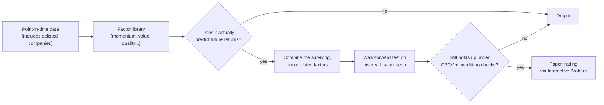
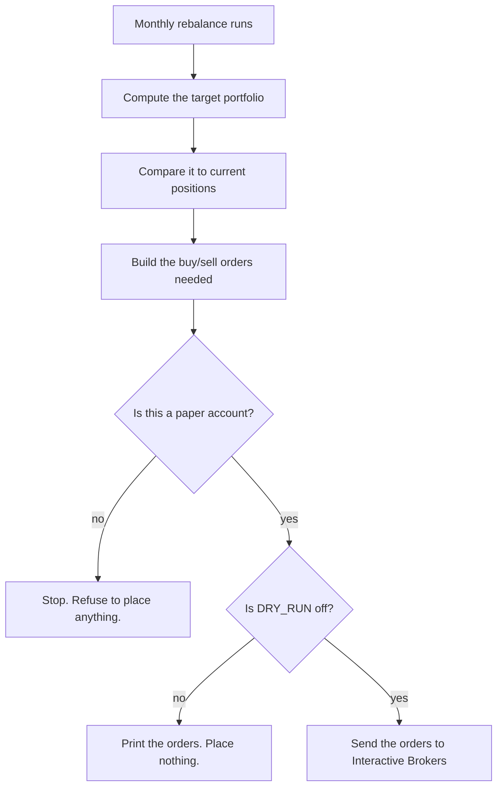

# pit-backtester


## What this is

Most backtests lie to you, usually by accident. A strategy can look great in a backtest
and still be worthless in real life, because the test used data that would not have been
available at the time, or because twenty ideas were tried and one happened to get lucky.

This project treats that as an engineering problem, not just a research problem.

- The price and fundamental data include companies that went bankrupt or got delisted,
  not just the ones still around today. Testing only on survivors makes every result look
  better than it really was.
- Every factor (a formula meant to predict returns) is automatically tested to prove it
  never uses future data. This is not a comment in the code that says "trust me." It is a
  test that builds fake data, deletes the future half of it, and checks that the answer
  does not change.
- Strategies are checked on stretches of history they never saw during development
  (walk-forward testing), then checked again with a method called combinatorial purged
  cross-validation, which splits history into many different train and test combinations
  instead of just one.
- After that, two statistical checks called the Deflated Sharpe Ratio and the Probability
  of Backtest Overfitting ask a blunt question: given how many things were tried, how
  likely is it that this result is just luck?
- The strategy that survives all of this is intentionally simple: buy stocks with strong
  recent momentum, skip the most recent month to avoid short term reversals, and shrink the
  position size when volatility spikes. The goal of this project was never to find a secret
  formula. It was to build a system that can tell a small, real edge apart from noise.

The last step connects to Interactive Brokers in paper trading mode (fake money, real
market data), with safety checks that make it very hard to place a live order by accident.

For the full walkthrough of how each piece works, read `ARCHITECTURE.md`.

## How it fits together



Every order placed by the paper trading step goes through the same safety checks:



## Prerequisites

- Python 3.11 or higher
- An Interactive Brokers paper trading account, with TWS or IB Gateway running locally and
  the API enabled (Global Configuration > API > Settings), needed for the `paper` command
- A Nasdaq Data Link (Sharadar) API key for the point-in-time data. Some commands still
  work without one, using free data instead. See `ARCHITECTURE.md`, Chapter 5.

## Setup

1. Clone the repo and move into it:
   ```
   git clone <your-repo-url>
   cd pit-backtester
   ```

2. Create and activate a virtual environment:
   ```
   python -m venv venv
   source venv/bin/activate      # Mac/Linux
   venv\Scripts\activate         # Windows
   ```

3. Install dependencies:
   ```
   pip install -r requirements.txt
   ```

4. Set up your environment variables:
   ```
   cp .env.example .env
   ```
   Then open `.env` and fill in your real keys. Never commit `.env`.

5. Build the offline Sharadar archive once (needs `NASDAQ_DATA_LINK_API_KEY`; every command
   after this runs with zero API calls):
   ```
   python data/archive_sharadar.py
   ```

## Running

`main.py` is the single entry point, with four subcommands:

```
python main.py factors                          # test each factor for predictive power
python main.py altdata                           # test insider/institutional signals vs momentum
python main.py strategy vol_managed_momentum     # backtest, walk-forward, and overfitting checks
python main.py paper vol_managed_momentum        # one monthly paper rebalance (needs TWS/IB Gateway)
```

Add `--no-broker` to `paper` for an offline preview that computes the target portfolio and
orders without connecting to anything.

## Testing

The core math and the safety checks are covered by an offline, deterministic pytest suite.
Nothing in it touches the network. Install the dev dependencies and run it:

```
pip install -r requirements-dev.txt
pytest
```

What's covered:

- **factors/** - the tests that check whether a factor predicts anything, plus an automatic
  check (`tests/test_no_lookahead.py`, using `hypothesis`) that proves every registered
  factor never uses future data. It works by generating random fake data, deleting
  everything after a cutoff date, and confirming each factor's value at that date does not
  change. This runs for many random seeds and symbol counts, not just one example.
- **strategies/** - the momentum strategy and the alternate versions it was tested against.
- **research/cpcv.py** - the math behind the overfitting checks: the split counts come out
  right, and the statistics give the expected answer on made-up data where the right answer
  is already known.
- **decision/** - the logic that turns a target portfolio into real buy and sell orders.
- **safety checks** - the rules that block real trades unless the account is a paper
  account and `DRY_RUN` is off. These are tested against a fake broker, so nothing here
  ever opens a real connection.

CI (`.github/workflows/ci.yml`) runs the full offline suite with coverage on every push and
pull request, and fails the build on any test failure.

## Project structure

```
pit-backtester/
  config.py          # settings: autonomy_mode, risk params, ports, keys from env
  data/              # point-in-time data (Sharadar) + the provider interface
  factors/           # factor library, predictive-power tests, evaluation scripts
  research/          # factor-combination, crash-fix, and overfitting checks
  strategies/        # the strategy that survived validation (vol-managed momentum)
  backtest/          # universes, walk-forward validation, benchmarks, risk metrics
  decision/          # the safety gate + the paper-rebalance runner
  execution/         # Interactive Brokers connection wrapper
  storage/           # sqlite layer (paper rebalance / target / order history)
  main.py
```

See `ARCHITECTURE.md`'s "Map of the repository" for what each file does.

## Safety

- The `paper` command talks to an IBKR paper account. Port 7497 is paper, 7496 is live.
  This project has never placed a live order and is not meant to.
- Never commit API keys or your `.env` file.

## Status

Every command listed under "Running" above works end to end, offline, against the local
Sharadar cache. See `ARCHITECTURE.md`'s "Honest limitations" for what this system genuinely
cannot do yet.
